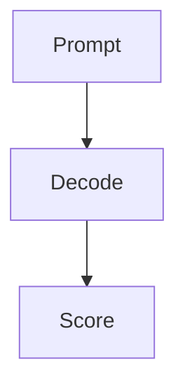

# CMS Phase 1 — Foundation Implementation Plan

> **For agentic workers:** REQUIRED SUB-SKILL: Use superpowers:subagent-driven-development (recommended) or superpowers:executing-plans to implement this plan task-by-task. Steps use checkbox (`- [ ]`) syntax for tracking.

**Goal:** Add the SQLite-backed indexed-cache substrate for the LLM Tutor CMS (Phase 1 of the 6-phase reframe in `~/.claude/plans/tender-snacking-puffin.md`) without changing any UI read path. All 490 existing tests stay green; the existing learner shell keeps working unchanged. This is purely additive infrastructure that Phase 2 will swap call sites onto.

**Architecture:**
- `CURRICULUM_DIR` remains the authoring source-of-truth (markdown + JSON sidecars).
- `better-sqlite3` opens a single cache file at `CURRICULUM_DIR/.llmtutor-cache.sqlite` with WAL.
- Indexer reuses existing parsers (`parseModule`, `validatePool`, `parseFlashcards`, `JsonStateStore.read`) — never reimplements them.
- Read API on top of SQLite returns the EXISTING UI shapes (`Module`, `MCQPool`, `Flashcard[]`, `ModuleState`, etc.) so Phase 2 can swap call sites with zero component changes.
- `'server-only'` guard at the top of every CMS module that touches the native binding, so a client-component import fails the Next build.

**Tech Stack:** Next.js 15 App Router, TypeScript strict, Node 22 runtime, `better-sqlite3` (native, sync), Vitest node-env, `@/` path alias, no new lint/build config.

**Branch:** `build/cms-1`. Frequent commits with trailer `Co-Authored-By: Claude Opus 4.7 (1M context) <noreply@anthropic.com>`.

**Definition of Done (every task):** `npm test` + `npm run typecheck` + `npm run lint` + `npm run build` all green before the commit lands.

---

## File Structure

**Created (new, all under `src/lib/cms/`):**
- `db.ts` — `better-sqlite3` connection factory + pragma setup + migration runner. Server-only.
- `schema.sql` — Empty file used as a barrel/comment-only entry point so the canonical schema lives in migration files (see below). The migrations directory is the authority.
- `migrations/001_initial.sql` — Initial schema: every table + index for Phase 1.
- `types.ts` — CMS-domain types: `EntityKind`, `IndexRow`, `StoredModule`, `StoredPool`, `StoredFlashcard`, `StoredSource`, `StoredAppState`, plus the read-API return-shape aliases that re-export the existing UI types.
- `hash.ts` — Pure `computeContentHash(text)` (sha256 hex).
- `indexer.ts` — `indexEntity`, `indexAll`, `indexState`. Impure edges (`readFile`, `stat`, `readdir`) injected via a `FsLike` parameter so tests use in-memory shims; real callers pass a default backed by `node:fs/promises`.
- `index.ts` — `getCmsIndex(dir)` factory + read API (`getCurriculum`, `getModule`, `getPool`, `getFlashcards`, `getModuleState`, `getAppState`, `getSources`) + write helpers (`reindexEntity`, `reindexState`, `reindexAll`). Server-only.
- `__tests__/hash.test.ts`
- `__tests__/db.test.ts`
- `__tests__/indexer-module.test.ts`
- `__tests__/indexer-pool.test.ts`
- `__tests__/indexer-flashcards.test.ts`
- `__tests__/indexer-state.test.ts`
- `__tests__/indexer-all.test.ts`
- `__tests__/index-read-api.test.ts`
- `__tests__/index-lazy-and-hash-diff.test.ts`
- `__tests__/fixtures/curriculum/B01-eval-harnesses.md`
- `__tests__/fixtures/curriculum/_flashcards.md`
- `__tests__/fixtures/curriculum/_llmtutor-state.json`
- `__tests__/fixtures/curriculum/mcq/B01.json`

**Modified:**
- `package.json` — add `better-sqlite3` runtime dep + `@types/better-sqlite3` dev dep.
- `.gitignore` — append `*.sqlite`, `*.sqlite-journal`, `*.sqlite-wal`, `*.sqlite-shm` so a stray cache file in-repo (e.g. when `CURRICULUM_DIR` is inside the repo for testing) is never committed.

**Untouched (verified Phase 1):** `app/(shell)/**`, `app/api/**`, `src/lib/ingest/**`, `src/lib/mcq/**`, `src/lib/cards/**`, `src/lib/state/**`, `src/lib/types.ts`. Phase 2 will modify `app/(shell)/**` and `app/api/state/route.ts`; Phase 1 must not.

---

## Task 1: Add `better-sqlite3` and a server-only guard, scaffold the `cms` directory

**Files:**
- Modify: `package.json`
- Modify: `.gitignore`
- Create: `src/lib/cms/.keep`

- [ ] **Step 1: Install deps**

Run:

```bash
cd /Users/unmukt/llm-tutor && npm install better-sqlite3@^11.5.0 server-only@^0.0.1 && npm install --save-dev @types/better-sqlite3@^7.6.12
```

Expected: install succeeds, `node_modules/better-sqlite3/build/Release/better_sqlite3.node` present (native build worked on Node 22).

- [ ] **Step 2: Verify native binding loads under Node 22**

Run:

```bash
cd /Users/unmukt/llm-tutor && node -e "const db = require('better-sqlite3')(':memory:'); db.exec('CREATE TABLE t(x INT)'); console.log(db.prepare('SELECT 1 AS one').get());"
```

Expected: prints `{ one: 1 }`. If the binding fails to load, abort — do not proceed.

- [ ] **Step 3: Append sqlite-cache patterns to `.gitignore`**

Edit `/Users/unmukt/llm-tutor/.gitignore` — append these lines at the end (before the trailing newline if present):

```
# CMS indexed cache (built at runtime under CURRICULUM_DIR)
*.sqlite
*.sqlite-journal
*.sqlite-wal
*.sqlite-shm
```

- [ ] **Step 4: Scaffold the cms directory**

Run:

```bash
mkdir -p /Users/unmukt/llm-tutor/src/lib/cms/migrations /Users/unmukt/llm-tutor/src/lib/cms/__tests__/fixtures/curriculum/mcq
: > /Users/unmukt/llm-tutor/src/lib/cms/.keep
```

- [ ] **Step 5: Run the four gates**

Run:

```bash
cd /Users/unmukt/llm-tutor && npm test && npm run typecheck && npm run lint && npm run build
```

Expected: all four pass, 490 tests still pass.

- [ ] **Step 6: Commit**

Run:

```bash
cd /Users/unmukt/llm-tutor && git checkout -b build/cms-1 2>/dev/null || git checkout build/cms-1
git add package.json package-lock.json .gitignore src/lib/cms/.keep
git commit -m "chore(cms): add better-sqlite3 dep + cms scaffold + gitignore

Phase 1 of the CMS reframe (see ~/.claude/plans/tender-snacking-puffin.md).
No code touches a read path yet.

Co-Authored-By: Claude Opus 4.7 (1M context) <noreply@anthropic.com>"
```

---

## Task 2: `computeContentHash` (pure, tested first)

**Files:**
- Create: `src/lib/cms/hash.ts`
- Create: `src/lib/cms/__tests__/hash.test.ts`

- [ ] **Step 1: Write the failing test**

Create `/Users/unmukt/llm-tutor/src/lib/cms/__tests__/hash.test.ts`:

```ts
import { describe, it, expect } from 'vitest';
import { computeContentHash } from '@/lib/cms/hash';

describe('computeContentHash', () => {
  it('is deterministic — same input always yields the same hash', () => {
    expect(computeContentHash('hello world')).toBe(computeContentHash('hello world'));
  });

  it('is a 64-char hex string (sha256)', () => {
    const h = computeContentHash('whatever');
    expect(h).toMatch(/^[0-9a-f]{64}$/);
  });

  it('is sensitive to whitespace', () => {
    expect(computeContentHash('a b')).not.toBe(computeContentHash('a  b'));
    expect(computeContentHash('a\n')).not.toBe(computeContentHash('a'));
  });

  it('distinguishes different content', () => {
    expect(computeContentHash('a')).not.toBe(computeContentHash('b'));
  });

  it('treats the empty string as a valid input (not an error)', () => {
    expect(computeContentHash('')).toMatch(/^[0-9a-f]{64}$/);
  });
});
```

- [ ] **Step 2: Run the test to verify it fails**

Run:

```bash
cd /Users/unmukt/llm-tutor && npx vitest run src/lib/cms/__tests__/hash.test.ts
```

Expected: FAIL with module-not-found for `@/lib/cms/hash`.

- [ ] **Step 3: Write the minimal implementation**

Create `/Users/unmukt/llm-tutor/src/lib/cms/hash.ts`:

```ts
import { createHash } from 'node:crypto';

/**
 * Stable, deterministic content hash used to detect file-content changes during
 * indexing. Sha256 of the UTF-8 bytes of the input string. Pure — no IO, no
 * platform-specific behavior, safe to unit-test against literals.
 */
export function computeContentHash(text: string): string {
  return createHash('sha256').update(text, 'utf8').digest('hex');
}
```

- [ ] **Step 4: Run the test to verify it passes**

Run:

```bash
cd /Users/unmukt/llm-tutor && npx vitest run src/lib/cms/__tests__/hash.test.ts
```

Expected: PASS, 5 tests.

- [ ] **Step 5: Run the four gates**

Run:

```bash
cd /Users/unmukt/llm-tutor && npm test && npm run typecheck && npm run lint && npm run build
```

Expected: all green.

- [ ] **Step 6: Commit**

```bash
cd /Users/unmukt/llm-tutor && git add src/lib/cms/hash.ts src/lib/cms/__tests__/hash.test.ts
git commit -m "feat(cms): add computeContentHash (sha256 hex, pure)

Co-Authored-By: Claude Opus 4.7 (1M context) <noreply@anthropic.com>"
```

---

## Task 3: CMS types module (compile-only — no runtime behavior to test)

**Files:**
- Create: `src/lib/cms/types.ts`

- [ ] **Step 1: Write the types module**

Create `/Users/unmukt/llm-tutor/src/lib/cms/types.ts`:

```ts
// CMS-domain types. The READ API of the CMS index returns the existing UI
// shapes from `@/lib/types` so Phase 2 can swap learner call sites without
// changing any component. The shapes below are SQLite-row mirrors used inside
// the indexer / read API only.

import type {
  Curriculum,
  Module,
  MCQPool,
  ModuleState,
  TutorState,
} from '@/lib/types';
import type { Flashcard } from '@/lib/cards/parse-flashcards';

/** Kind of content entity the indexer knows how to refresh. */
export type EntityKind = 'module' | 'pool' | 'flashcards' | 'source' | 'state';

/** Tracking row for any indexed file. `content_hash` is the sha256 of file bytes
 *  at index time; `mtime_ms` is the file's mtime in ms epoch at index time.
 *  Updated together inside one SQL transaction with the entity rows. */
export interface IndexRow {
  kind: EntityKind;
  id: string;                // module id, pool id, '_flashcards', source id, '__state__'
  rel_path: string;          // relative to CURRICULUM_DIR
  content_hash: string;
  mtime_ms: number;
  updated_at: number;        // ms epoch when row was written
}

/** Internal storage shape for a module row. The full `Module` is reconstructed
 *  by the read API by joining child tables (passes, visuals, drills, etc.). */
export interface StoredModule {
  id: string;
  track: string;
  name: string;
  prerequisites: string[];   // JSON
  primary_sources: string[]; // JSON
  why_this_matters: string;
  anchors: string[];         // JSON
  lab_spec: string | null;
  sources: string[];         // JSON (the rendered `## Sources` lines)
  content_hash: string;
  updated_at: number;
}

/** Internal storage shape for an MCQ pool row + denormalized question rows. */
export interface StoredPool {
  pool: { module_id: string; content_hash: string; updated_at: number };
}

/** Internal storage shape for a flashcard row. */
export interface StoredFlashcard extends Flashcard {
  content_hash: string;      // hash of the pre-split source line
  updated_at: number;
}

/** Source entity (Phase 4 will populate; Phase 1 only creates the table). */
export interface StoredSource {
  id: string;
  kind: string;
  url: string | null;
  title: string;
  raw_text: string;
  summary: string | null;
  content_hash: string;
  fetched_at: number | null;
  updated_at: number;
}

/** App-singleton state (xp, streak, version, sessionLog as JSON). */
export interface StoredAppState {
  version: number;
  xp_total: number;
  xp_this_week: number;
  streak_count: number;
  streak_last_active: string;
  streak_freeze_tokens: number;
  session_log: TutorState['sessionLog']; // JSON
  updated_at: number;
}

// ── Read-API return shapes (UI types, re-exported for clarity) ──────────────
export type { Curriculum, Module, MCQPool, ModuleState, TutorState, Flashcard };

/** Flat row the read API yields for the rendered "Sources" surface in Phase 2.
 *  Phase 1 returns an empty array; Phase 4 populates from `_sources.json`. */
export interface SourceRowsAsRendered {
  id: string;
  title: string;
  url: string | null;
  summary: string | null;
}
```

- [ ] **Step 2: Run the gates**

Run:

```bash
cd /Users/unmukt/llm-tutor && npm test && npm run typecheck && npm run lint && npm run build
```

Expected: all green.

- [ ] **Step 3: Commit**

```bash
cd /Users/unmukt/llm-tutor && git add src/lib/cms/types.ts
git commit -m "feat(cms): add CMS-domain types (StoredModule, IndexRow, EntityKind)

Co-Authored-By: Claude Opus 4.7 (1M context) <noreply@anthropic.com>"
```

---

## Task 4: SQL schema migration `001_initial.sql`

**Files:**
- Create: `src/lib/cms/migrations/001_initial.sql`
- Create: `src/lib/cms/schema.sql`

- [ ] **Step 1: Write the initial migration**

Create `/Users/unmukt/llm-tutor/src/lib/cms/migrations/001_initial.sql`:

```sql
-- CMS Phase 1 — initial schema.
-- Every content entity carries content_hash + updated_at (ms epoch).
-- Source-of-truth stays on disk; this DB is a cache that the indexer rebuilds.

CREATE TABLE IF NOT EXISTS _schema_migrations (
  name      TEXT PRIMARY KEY,
  applied_at INTEGER NOT NULL
);

CREATE TABLE IF NOT EXISTS modules (
  id                TEXT PRIMARY KEY,
  track             TEXT NOT NULL,
  name              TEXT NOT NULL,
  prerequisites     TEXT NOT NULL DEFAULT '[]',     -- JSON array
  primary_sources   TEXT NOT NULL DEFAULT '[]',     -- JSON array
  why_this_matters  TEXT NOT NULL DEFAULT '',
  anchors           TEXT NOT NULL DEFAULT '[]',     -- JSON array
  lab_spec          TEXT,
  sources           TEXT NOT NULL DEFAULT '[]',     -- JSON array of rendered lines
  ord               INTEGER NOT NULL DEFAULT 0,     -- file-order rank
  content_hash      TEXT NOT NULL,
  updated_at        INTEGER NOT NULL
);
CREATE INDEX IF NOT EXISTS idx_modules_track_ord ON modules(track, ord);

CREATE TABLE IF NOT EXISTS module_passes (
  module_id TEXT NOT NULL REFERENCES modules(id) ON DELETE CASCADE,
  pass      TEXT NOT NULL CHECK (pass IN ('tenYearOld','engineer','operator')),
  body      TEXT NOT NULL,
  PRIMARY KEY (module_id, pass)
);

CREATE TABLE IF NOT EXISTS module_visuals (
  module_id TEXT NOT NULL REFERENCES modules(id) ON DELETE CASCADE,
  ord       INTEGER NOT NULL,
  type      TEXT NOT NULL,
  title     TEXT,
  data_json TEXT NOT NULL,
  PRIMARY KEY (module_id, ord)
);

CREATE TABLE IF NOT EXISTS module_diagrams (
  module_id TEXT NOT NULL REFERENCES modules(id) ON DELETE CASCADE,
  ord       INTEGER NOT NULL,
  kind      TEXT NOT NULL CHECK (kind IN ('mermaid','ascii','code')),
  body      TEXT NOT NULL,
  PRIMARY KEY (module_id, ord)
);

CREATE TABLE IF NOT EXISTS module_drills (
  module_id TEXT NOT NULL REFERENCES modules(id) ON DELETE CASCADE,
  ord       INTEGER NOT NULL,
  scenario  TEXT NOT NULL,
  dc1       TEXT,
  dc2       TEXT,
  PRIMARY KEY (module_id, ord)
);

CREATE TABLE IF NOT EXISTS module_stress_tests (
  module_id TEXT NOT NULL REFERENCES modules(id) ON DELETE CASCADE,
  ord       INTEGER NOT NULL,
  lens      TEXT NOT NULL CHECK (lens IN ('board','researcher','analyst')),
  question  TEXT NOT NULL,
  PRIMARY KEY (module_id, ord)
);

CREATE TABLE IF NOT EXISTS module_flashcard_seeds (
  module_id TEXT NOT NULL REFERENCES modules(id) ON DELETE CASCADE,
  ord       INTEGER NOT NULL,
  seed      TEXT NOT NULL,
  PRIMARY KEY (module_id, ord)
);

CREATE TABLE IF NOT EXISTS mcq_pools (
  module_id    TEXT PRIMARY KEY REFERENCES modules(id) ON DELETE CASCADE,
  content_hash TEXT NOT NULL,
  updated_at   INTEGER NOT NULL
);

CREATE TABLE IF NOT EXISTS mcq_questions (
  id              TEXT PRIMARY KEY,
  module_id       TEXT NOT NULL REFERENCES mcq_pools(module_id) ON DELETE CASCADE,
  ord             INTEGER NOT NULL,
  difficulty      TEXT NOT NULL CHECK (difficulty IN ('easy','medium','hard')),
  dimension       TEXT NOT NULL CHECK (dimension IN ('topic','logic','example','extension')),
  stem            TEXT NOT NULL,
  options_json    TEXT NOT NULL,                 -- JSON array, length 4
  correct_index   INTEGER NOT NULL CHECK (correct_index BETWEEN 0 AND 3),
  distractor_json TEXT NOT NULL,                 -- JSON object
  explanation     TEXT NOT NULL,
  source_ref      TEXT
);
CREATE INDEX IF NOT EXISTS idx_mcq_questions_module ON mcq_questions(module_id, ord);

CREATE TABLE IF NOT EXISTS flashcards (
  id           TEXT PRIMARY KEY,
  module_id    TEXT,
  last_tested  TEXT,
  front        TEXT NOT NULL,
  back         TEXT NOT NULL,
  ord          INTEGER NOT NULL,
  content_hash TEXT NOT NULL,
  updated_at   INTEGER NOT NULL
);
CREATE INDEX IF NOT EXISTS idx_flashcards_module ON flashcards(module_id);

CREATE TABLE IF NOT EXISTS sources (
  id           TEXT PRIMARY KEY,
  kind         TEXT NOT NULL,
  url          TEXT,
  title        TEXT NOT NULL,
  raw_text     TEXT NOT NULL DEFAULT '',
  summary      TEXT,
  content_hash TEXT NOT NULL,
  fetched_at   INTEGER,
  updated_at   INTEGER NOT NULL
);

CREATE TABLE IF NOT EXISTS module_sources (
  module_id TEXT NOT NULL REFERENCES modules(id) ON DELETE CASCADE,
  source_id TEXT NOT NULL REFERENCES sources(id) ON DELETE CASCADE,
  PRIMARY KEY (module_id, source_id)
);

-- Mirror of the sidecar `_llmtutor-state.json` modules[id] map. Sidecar is SoT;
-- this table is rewritten by indexState() and read by getModuleState().
CREATE TABLE IF NOT EXISTS module_state (
  module_id  TEXT PRIMARY KEY,
  state_json TEXT NOT NULL,
  updated_at INTEGER NOT NULL
);

-- Mirror of the sidecar's flashcards map (keyed by card id).
CREATE TABLE IF NOT EXISTS flashcard_state (
  card_id    TEXT PRIMARY KEY,
  state_json TEXT NOT NULL,
  updated_at INTEGER NOT NULL
);

-- Singleton row: xp / streak / sessionLog / version. The row's PK is fixed at 1.
CREATE TABLE IF NOT EXISTS app_state (
  id                 INTEGER PRIMARY KEY CHECK (id = 1),
  version            INTEGER NOT NULL,
  xp_total           INTEGER NOT NULL DEFAULT 0,
  xp_this_week       INTEGER NOT NULL DEFAULT 0,
  streak_count       INTEGER NOT NULL DEFAULT 0,
  streak_last_active TEXT NOT NULL DEFAULT '',
  streak_freeze_tokens INTEGER NOT NULL DEFAULT 0,
  session_log_json   TEXT NOT NULL DEFAULT '[]',
  updated_at         INTEGER NOT NULL
);

-- Tracks every indexed file for change detection (mtime + hash).
CREATE TABLE IF NOT EXISTS index_rows (
  kind         TEXT NOT NULL,
  id           TEXT NOT NULL,
  rel_path     TEXT NOT NULL,
  content_hash TEXT NOT NULL,
  mtime_ms     INTEGER NOT NULL,
  updated_at   INTEGER NOT NULL,
  PRIMARY KEY (kind, id)
);

-- Audit log (Phase 3+ uses this; Phase 1 just creates the table).
CREATE TABLE IF NOT EXISTS revisions (
  id         INTEGER PRIMARY KEY AUTOINCREMENT,
  kind       TEXT NOT NULL,
  entity_id  TEXT NOT NULL,
  at         INTEGER NOT NULL,
  actor      TEXT,
  note       TEXT,
  diff_json  TEXT
);
CREATE INDEX IF NOT EXISTS idx_revisions_kind_entity ON revisions(kind, entity_id, at);
```

- [ ] **Step 2: Add a pointer file**

Create `/Users/unmukt/llm-tutor/src/lib/cms/schema.sql`:

```sql
-- Canonical schema lives in src/lib/cms/migrations/. This file exists as a
-- discoverable entry point only. The migration runner (db.ts) applies every
-- file under ./migrations/ in lexicographic order and tracks them in
-- `_schema_migrations`.
```

- [ ] **Step 3: Run the gates**

Run:

```bash
cd /Users/unmukt/llm-tutor && npm test && npm run typecheck && npm run lint && npm run build
```

Expected: all green (no new code paths yet).

- [ ] **Step 4: Commit**

```bash
cd /Users/unmukt/llm-tutor && git add src/lib/cms/migrations/001_initial.sql src/lib/cms/schema.sql
git commit -m "feat(cms): add 001_initial.sql migration (modules, pools, flashcards, state, sources)

Co-Authored-By: Claude Opus 4.7 (1M context) <noreply@anthropic.com>"
```

---

## Task 5: `db.ts` — connection factory + migration runner, with tests

**Files:**
- Create: `src/lib/cms/db.ts`
- Create: `src/lib/cms/__tests__/db.test.ts`

- [ ] **Step 1: Write the failing test**

Create `/Users/unmukt/llm-tutor/src/lib/cms/__tests__/db.test.ts`:

```ts
import { describe, it, expect, beforeEach, afterEach } from 'vitest';
import { mkdtemp, rm } from 'node:fs/promises';
import { tmpdir } from 'node:os';
import { join } from 'node:path';
import { getDb, runMigrations } from '@/lib/cms/db';

describe('cms/db', () => {
  let dir: string;
  beforeEach(async () => {
    dir = await mkdtemp(join(tmpdir(), 'cms-db-'));
  });
  afterEach(async () => {
    await rm(dir, { recursive: true, force: true });
  });

  it('opens an on-disk DB, sets WAL + foreign_keys ON', () => {
    const db = getDb(join(dir, 'cache.sqlite'));
    expect(db.pragma('journal_mode', { simple: true })).toBe('wal');
    expect(db.pragma('foreign_keys', { simple: true })).toBe(1);
    db.close();
  });

  it('opens an in-memory DB when path is ":memory:"', () => {
    const db = getDb(':memory:');
    // in-memory DBs do not support WAL; just assert it opened.
    const row = db.prepare('SELECT 1 AS one').get();
    expect(row).toEqual({ one: 1 });
    db.close();
  });

  it('runMigrations applies every file under migrations/ exactly once', () => {
    const db = getDb(':memory:');
    runMigrations(db);
    const applied = db
      .prepare("SELECT name FROM _schema_migrations ORDER BY name")
      .all() as { name: string }[];
    expect(applied.map((r) => r.name)).toEqual(['001_initial.sql']);

    // The tables exist.
    const tables = db
      .prepare("SELECT name FROM sqlite_master WHERE type='table' ORDER BY name")
      .all() as { name: string }[];
    const names = tables.map((t) => t.name);
    for (const t of [
      'modules', 'module_passes', 'module_visuals', 'module_diagrams',
      'module_drills', 'module_stress_tests', 'module_flashcard_seeds',
      'mcq_pools', 'mcq_questions', 'flashcards',
      'sources', 'module_sources',
      'module_state', 'flashcard_state', 'app_state',
      'index_rows', 'revisions', '_schema_migrations',
    ]) {
      expect(names).toContain(t);
    }

    // Second run is a no-op (idempotent).
    runMigrations(db);
    const applied2 = db
      .prepare("SELECT name FROM _schema_migrations")
      .all() as { name: string }[];
    expect(applied2.length).toBe(1);
    db.close();
  });
});
```

- [ ] **Step 2: Run to confirm it fails**

Run:

```bash
cd /Users/unmukt/llm-tutor && npx vitest run src/lib/cms/__tests__/db.test.ts
```

Expected: FAIL with module-not-found for `@/lib/cms/db`.

- [ ] **Step 3: Implement `db.ts`**

Create `/Users/unmukt/llm-tutor/src/lib/cms/db.ts`:

```ts
import 'server-only';
import Database, { type Database as BSDatabase } from 'better-sqlite3';
import { readFileSync, readdirSync, existsSync, mkdirSync } from 'node:fs';
import { dirname, join } from 'node:path';
import { fileURLToPath } from 'node:url';

/**
 * Opens (or creates) a better-sqlite3 connection at `dbPath`. Sets sane pragmas:
 *   - journal_mode = WAL (or MEMORY when in-memory)
 *   - synchronous = NORMAL
 *   - foreign_keys = ON
 *   - busy_timeout = 5000ms
 *
 * Pure-where-possible: callers pass the path; testing passes ':memory:'.
 * Does NOT run migrations — call `runMigrations(db)` next.
 */
export function getDb(dbPath: string): BSDatabase {
  if (dbPath !== ':memory:') {
    const parent = dirname(dbPath);
    if (!existsSync(parent)) mkdirSync(parent, { recursive: true });
  }
  const db = new Database(dbPath);
  // WAL is illegal on in-memory DBs; better-sqlite3 quietly ignores attempts.
  if (dbPath !== ':memory:') db.pragma('journal_mode = WAL');
  db.pragma('synchronous = NORMAL');
  db.pragma('foreign_keys = ON');
  db.pragma('busy_timeout = 5000');
  return db;
}

/** Directory holding numbered `.sql` migration files, resolved from this module. */
function migrationsDir(): string {
  // `import.meta.url` resolves to `.../src/lib/cms/db.ts` in dev/test and to
  // the compiled file under `.next` at runtime; in both cases the migrations
  // directory sits beside it.
  return join(dirname(fileURLToPath(import.meta.url)), 'migrations');
}

/**
 * Applies every migration file under ./migrations/ in lexicographic order,
 * tracking applied names in `_schema_migrations`. Idempotent: re-running is a
 * no-op. Each migration runs inside an exec() (multi-statement allowed).
 */
export function runMigrations(db: BSDatabase, dir: string = migrationsDir()): void {
  db.exec(`
    CREATE TABLE IF NOT EXISTS _schema_migrations (
      name       TEXT PRIMARY KEY,
      applied_at INTEGER NOT NULL
    );
  `);

  const files = readdirSync(dir)
    .filter((f) => f.endsWith('.sql'))
    .sort();

  const applied = new Set(
    (db.prepare('SELECT name FROM _schema_migrations').all() as { name: string }[]).map((r) => r.name),
  );

  const insert = db.prepare('INSERT INTO _schema_migrations(name, applied_at) VALUES (?, ?)');

  for (const file of files) {
    if (applied.has(file)) continue;
    const sql = readFileSync(join(dir, file), 'utf8');
    const tx = db.transaction(() => {
      db.exec(sql);
      insert.run(file, Date.now());
    });
    tx();
  }
}
```

- [ ] **Step 4: Run the test to verify it passes**

Run:

```bash
cd /Users/unmukt/llm-tutor && npx vitest run src/lib/cms/__tests__/db.test.ts
```

Expected: PASS, 3 tests.

- [ ] **Step 5: Run the four gates**

Run:

```bash
cd /Users/unmukt/llm-tutor && npm test && npm run typecheck && npm run lint && npm run build
```

Expected: all green. If `next build` complains about `server-only` being imported from a server-only context — that is correct behavior; the build only fails if a CLIENT component imports it.

- [ ] **Step 6: Commit**

```bash
cd /Users/unmukt/llm-tutor && git add src/lib/cms/db.ts src/lib/cms/__tests__/db.test.ts
git commit -m "feat(cms): add getDb + runMigrations (WAL, FKs ON, idempotent)

Co-Authored-By: Claude Opus 4.7 (1M context) <noreply@anthropic.com>"
```

---

## Task 6: Test fixtures — a self-contained mini-curriculum

**Files:**
- Create: `src/lib/cms/__tests__/fixtures/curriculum/B01-eval-harnesses.md`
- Create: `src/lib/cms/__tests__/fixtures/curriculum/_flashcards.md`
- Create: `src/lib/cms/__tests__/fixtures/curriculum/_llmtutor-state.json`
- Create: `src/lib/cms/__tests__/fixtures/curriculum/mcq/B01.json`

> These fixtures are dedicated to CMS tests (we do NOT touch `src/lib/ingest/__tests__/fixtures/`). The module fixture is derived from the existing `B01-sample.md` so the round-trip test can call `parseModule` on the SAME bytes and deep-equal the indexer output.

- [ ] **Step 1: Copy + extend the module fixture**

Create `/Users/unmukt/llm-tutor/src/lib/cms/__tests__/fixtures/curriculum/B01-eval-harnesses.md`:

```markdown
---
module_id: B01
track: B
name: Eval harnesses & harness engineering
prerequisites: [M03, M04]
primary_sources: [S4, S5]
---

# Eval harnesses & harness engineering

## Why this matters

If your harness is wrong, every score downstream is a confident lie.

## Anchor scenarios

1. You ship a model and the eval says 92%; production says 60%.
2. The board asks why the number moved.

### 10-year-old pass

A test is only fair if everyone takes the same test the same way.

### Engineer pass

A harness pins prompts, decoding, and scoring so score deltas mean capability deltas.



```text
[prompt] -> [decode] -> [score]
```

### Operator pass

If you cannot defend the harness to an auditor, you cannot defend the number.

## Lab spec

Pin temperature, top-p, max_tokens; freeze prompt; record decode params.

### Drill 1

Scenario: Two graders disagree on a free-form answer.
DC1: Switch to MCQ format with locked options.
DC2: Add a tie-break grader.

## Stress-test pool

- board: How would you defend the eval number to an auditor?
- researcher: What invariances does the harness preserve?
- analyst: Which decoder knob most changes the score and why?

## Flashcard seeds

- What makes an eval fair? :: Invariance to nuisance factors.
- What is a harness? :: The scaffold around the eval.

## Sources

- S4: Eval methodology playbook
- S5: Harness engineering notes
```

- [ ] **Step 2: Write the flashcards fixture**

Create `/Users/unmukt/llm-tutor/src/lib/cms/__tests__/fixtures/curriculum/_flashcards.md`:

```markdown
# Flashcards

- module:B01 last-tested:2026-05-20 What makes an eval "fair"? :: Invariance to nuisance factors.
- module:B01 What is a harness? :: The scaffold around the eval.
```

- [ ] **Step 3: Write the MCQ pool fixture**

Create `/Users/unmukt/llm-tutor/src/lib/cms/__tests__/fixtures/curriculum/mcq/B01.json`:

```json
{
  "moduleId": "B01",
  "questions": [
    {
      "id": "B01-q001",
      "moduleId": "B01",
      "difficulty": "easy",
      "dimension": "topic",
      "stem": "What does an eval harness primarily pin?",
      "options": [
        "Prompts, decoding params, and scoring",
        "Only the prompt",
        "Only the scoring",
        "The model weights"
      ],
      "correctIndex": 0,
      "distractorMisconception": {
        "1": "Conflates the prompt with the full harness.",
        "2": "Confuses scoring with the harness as a whole.",
        "3": "Mistakes the eval substrate for the model under test."
      },
      "explanation": "A harness pins prompts, decoding, and scoring so score deltas reflect capability.",
      "sourceRef": "S4"
    },
    {
      "id": "B01-q002",
      "moduleId": "B01",
      "difficulty": "medium",
      "dimension": "logic",
      "stem": "Why does the harness need to fix decoding parameters?",
      "options": [
        "So score deltas attribute to the model, not the sampler",
        "So the model runs faster",
        "So the prompt can be shorter",
        "So humans can grade more easily"
      ],
      "correctIndex": 0,
      "distractorMisconception": {
        "1": "Confuses harness purpose with throughput.",
        "2": "Wrong: prompt length is independent of decoding fixing.",
        "3": "Confuses harness with grading affordances."
      },
      "explanation": "Floating decode params leak sampler-noise into score deltas.",
      "sourceRef": "S5"
    }
  ]
}
```

- [ ] **Step 4: Write the state-sidecar fixture**

Create `/Users/unmukt/llm-tutor/src/lib/cms/__tests__/fixtures/curriculum/_llmtutor-state.json`:

```json
{
  "version": 1,
  "modules": {
    "B01": {
      "mastery": "fuzzy",
      "masteryHistory": [{ "level": "fuzzy", "at": "2026-05-20T10:00:00.000Z", "via": "mcq" }],
      "mcq": {
        "matrix": { "easy": { "topic": { "seen": 1, "correct": 1 } }, "medium": {}, "hard": {} },
        "distractorLog": [],
        "dimensionProfile": { "topic": "solid", "logic": "untested", "example": "untested", "extension": "untested" },
        "recentCorrect": [{ "qid": "B01-q001", "at": "2026-05-20T10:00:00.000Z" }]
      },
      "stressTest": {}
    }
  },
  "flashcards": {
    "B01-c01": { "lastTested": "2026-05-20", "intervalDays": 14, "ease": "good" }
  },
  "xp": { "total": 42, "thisWeek": 7 },
  "streak": { "count": 3, "lastActive": "2026-05-28", "freezeTokens": 1 },
  "sessionLog": [{ "module": "B01", "at": "2026-05-28T09:00:00.000Z", "events": ["read:engineer", "mcq:6"] }]
}
```

- [ ] **Step 5: Quick sanity check — fixtures are well-formed**

Run:

```bash
cd /Users/unmukt/llm-tutor && node -e "
const fs = require('node:fs');
JSON.parse(fs.readFileSync('src/lib/cms/__tests__/fixtures/curriculum/mcq/B01.json','utf8'));
JSON.parse(fs.readFileSync('src/lib/cms/__tests__/fixtures/curriculum/_llmtutor-state.json','utf8'));
console.log('ok');
"
```

Expected: prints `ok`.

- [ ] **Step 6: Run gates + commit**

```bash
cd /Users/unmukt/llm-tutor && npm test && npm run typecheck && npm run lint && npm run build
git add src/lib/cms/__tests__/fixtures
git commit -m "test(cms): add mini-curriculum fixtures (B01 module + pool + flashcards + state)

Co-Authored-By: Claude Opus 4.7 (1M context) <noreply@anthropic.com>"
```

---

## Task 7: `indexEntity('module', ...)` — module round-trip

**Files:**
- Create: `src/lib/cms/indexer.ts`
- Create: `src/lib/cms/__tests__/indexer-module.test.ts`

- [ ] **Step 1: Write the failing test**

Create `/Users/unmukt/llm-tutor/src/lib/cms/__tests__/indexer-module.test.ts`:

```ts
import { describe, it, expect } from 'vitest';
import { readFile } from 'node:fs/promises';
import { resolve } from 'node:path';
import { getDb, runMigrations } from '@/lib/cms/db';
import { indexEntity, readModule } from '@/lib/cms/indexer';
import { parseModule } from '@/lib/ingest/parse-module';

const FIXTURE_DIR = resolve(__dirname, 'fixtures/curriculum');

describe("indexEntity('module', 'B01')", () => {
  it('round-trips: indexed Module deep-equals parseModule(file bytes)', async () => {
    const db = getDb(':memory:');
    runMigrations(db);

    await indexEntity(db, FIXTURE_DIR, 'module', 'B01');

    const fromCache = readModule(db, 'B01');
    expect(fromCache).not.toBeNull();

    const raw = await readFile(resolve(FIXTURE_DIR, 'B01-eval-harnesses.md'), 'utf8');
    const fromDisk = parseModule(raw);

    expect(fromCache).toEqual(fromDisk);
    db.close();
  });

  it('writes an index_rows entry with a non-empty content_hash', async () => {
    const db = getDb(':memory:');
    runMigrations(db);

    await indexEntity(db, FIXTURE_DIR, 'module', 'B01');

    const row = db
      .prepare("SELECT kind, id, content_hash FROM index_rows WHERE kind='module' AND id='B01'")
      .get() as { kind: string; id: string; content_hash: string } | undefined;
    expect(row).toBeDefined();
    expect(row!.content_hash).toMatch(/^[0-9a-f]{64}$/);
    db.close();
  });

  it("skips a second index call when the content hash hasn't changed", async () => {
    const db = getDb(':memory:');
    runMigrations(db);

    await indexEntity(db, FIXTURE_DIR, 'module', 'B01');
    const before = (db.prepare("SELECT updated_at FROM index_rows WHERE kind='module' AND id='B01'").get() as { updated_at: number }).updated_at;

    await indexEntity(db, FIXTURE_DIR, 'module', 'B01');
    const after = (db.prepare("SELECT updated_at FROM index_rows WHERE kind='module' AND id='B01'").get() as { updated_at: number }).updated_at;

    expect(after).toBe(before);
    db.close();
  });
});
```

- [ ] **Step 2: Run to confirm it fails**

Run:

```bash
cd /Users/unmukt/llm-tutor && npx vitest run src/lib/cms/__tests__/indexer-module.test.ts
```

Expected: FAIL with module-not-found for `@/lib/cms/indexer`.

- [ ] **Step 3: Implement `indexer.ts` (module-only, scaffold for later tasks)**

Create `/Users/unmukt/llm-tutor/src/lib/cms/indexer.ts`:

```ts
import { promises as fsp } from 'node:fs';
import { readdirSync } from 'node:fs';
import { join } from 'node:path';
import type { Database as BSDatabase } from 'better-sqlite3';

import type { EntityKind, Module } from '@/lib/cms/types';
import { computeContentHash } from '@/lib/cms/hash';
import { parseModule } from '@/lib/ingest/parse-module';

/** Injectable FS edge — tests pass an in-memory implementation. */
export interface FsLike {
  readFile(path: string): Promise<string>;
  stat(path: string): Promise<{ mtimeMs: number }>;
  readdir(path: string): Promise<string[]>;
}

export const defaultFs: FsLike = {
  readFile: (p) => fsp.readFile(p, 'utf8'),
  stat: async (p) => {
    const s = await fsp.stat(p);
    return { mtimeMs: s.mtimeMs };
  },
  readdir: async (p) => fsp.readdir(p),
};

/** Resolve the on-disk file path for a (kind, id) under CURRICULUM_DIR. */
function pathFor(dir: string, kind: EntityKind, id: string): string {
  switch (kind) {
    case 'module':
      // Match the existing CurriculumRepository naming: any *.md whose frontmatter
      // module_id === id. The fixture file is `<id>-<slug>.md`; the resolver
      // uses a synchronous readdir scan for simplicity (called once per entity).
      return resolveModulePath(dir, id);
    case 'pool':
      return join(dir, 'mcq', `${id}.json`);
    case 'flashcards':
      return join(dir, '_flashcards.md');
    case 'state':
      return join(dir, '_llmtutor-state.json');
    case 'source':
      // Phase 4 wires this up; Phase 1 returns the path for symmetry.
      return join(dir, '_sources.json');
  }
}

function resolveModulePath(dir: string, id: string): string {
  // Prefer `<id>-<slug>.md`; otherwise scan and look for a frontmatter match.
  // The scan is cheap (one curriculum dir) and matches the CurriculumRepository's
  // existing filter (`*.md`, skip `_`-prefixed).
  const candidates = readdirSync(dir)
    .filter((f) => f.endsWith('.md') && !f.startsWith('_'));
  const direct = candidates.find((f) => f.startsWith(`${id}-`) || f === `${id}.md`);
  if (direct) return join(dir, direct);
  throw new Error(`indexer: no module file found for id "${id}" in ${dir}`);
}

/**
 * Index one entity, end-to-end:
 *   1. read the file
 *   2. compute content_hash; if unchanged vs index_rows row, return early
 *   3. parse with the existing parser
 *   4. write entity rows + the index_rows tracking row inside one transaction
 *
 * Module is the only kind implemented in this task; the switch grows in
 * subsequent tasks (pool, flashcards, state).
 */
export async function indexEntity(
  db: BSDatabase,
  dir: string,
  kind: EntityKind,
  id: string,
  fs: FsLike = defaultFs,
): Promise<void> {
  const filePath = pathFor(dir, kind, id);
  const raw = await fs.readFile(filePath);
  const hash = computeContentHash(raw);
  const { mtimeMs } = await fs.stat(filePath);

  const prev = db
    .prepare('SELECT content_hash FROM index_rows WHERE kind = ? AND id = ?')
    .get(kind, id) as { content_hash: string } | undefined;
  if (prev && prev.content_hash === hash) return;

  switch (kind) {
    case 'module':
      writeModule(db, id, raw, hash, mtimeMs, filePath, dir);
      return;
    default:
      // Other kinds land in later tasks.
      throw new Error(`indexEntity: kind "${kind}" not implemented yet`);
  }
}

function writeModule(
  db: BSDatabase,
  id: string,
  raw: string,
  hash: string,
  mtimeMs: number,
  absPath: string,
  dir: string,
): void {
  const mod = parseModule(raw);
  if (mod.id !== id) {
    throw new Error(`indexer: file at ${absPath} has module_id "${mod.id}", expected "${id}"`);
  }
  const now = Date.now();
  const rel = absPath.startsWith(dir + '/') ? absPath.slice(dir.length + 1) : absPath;

  const tx = db.transaction(() => {
    db.prepare(
      `INSERT INTO modules (id, track, name, prerequisites, primary_sources, why_this_matters, anchors, lab_spec, sources, ord, content_hash, updated_at)
       VALUES (@id, @track, @name, @prerequisites, @primary_sources, @why_this_matters, @anchors, @lab_spec, @sources, @ord, @content_hash, @updated_at)
       ON CONFLICT(id) DO UPDATE SET
         track=excluded.track,
         name=excluded.name,
         prerequisites=excluded.prerequisites,
         primary_sources=excluded.primary_sources,
         why_this_matters=excluded.why_this_matters,
         anchors=excluded.anchors,
         lab_spec=excluded.lab_spec,
         sources=excluded.sources,
         content_hash=excluded.content_hash,
         updated_at=excluded.updated_at`,
    ).run({
      id: mod.id,
      track: mod.track,
      name: mod.name,
      prerequisites: JSON.stringify(mod.prerequisites),
      primary_sources: JSON.stringify(mod.primarySources),
      why_this_matters: mod.whyThisMatters,
      anchors: JSON.stringify(mod.anchors),
      lab_spec: mod.labSpec ?? null,
      sources: JSON.stringify(mod.sources),
      ord: 0,
      content_hash: hash,
      updated_at: now,
    });

    // Clear + rewrite all child rows so updates can shrink lists too.
    db.prepare('DELETE FROM module_passes  WHERE module_id = ?').run(mod.id);
    db.prepare('DELETE FROM module_visuals WHERE module_id = ?').run(mod.id);
    db.prepare('DELETE FROM module_diagrams WHERE module_id = ?').run(mod.id);
    db.prepare('DELETE FROM module_drills  WHERE module_id = ?').run(mod.id);
    db.prepare('DELETE FROM module_stress_tests WHERE module_id = ?').run(mod.id);
    db.prepare('DELETE FROM module_flashcard_seeds WHERE module_id = ?').run(mod.id);

    const insPass = db.prepare(
      'INSERT INTO module_passes(module_id, pass, body) VALUES (?,?,?)',
    );
    for (const [pass, body] of Object.entries(mod.passes)) {
      if (body !== undefined) insPass.run(mod.id, pass, body);
    }

    const insViz = db.prepare(
      'INSERT INTO module_visuals(module_id, ord, type, title, data_json) VALUES (?,?,?,?,?)',
    );
    mod.visuals.forEach((v, i) => insViz.run(mod.id, i, v.type, v.title ?? null, JSON.stringify(v.data)));

    const insDiag = db.prepare(
      'INSERT INTO module_diagrams(module_id, ord, kind, body) VALUES (?,?,?,?)',
    );
    mod.diagrams.forEach((d, i) => insDiag.run(mod.id, i, d.kind, d.body));

    const insDrill = db.prepare(
      'INSERT INTO module_drills(module_id, ord, scenario, dc1, dc2) VALUES (?,?,?,?,?)',
    );
    mod.drills.forEach((d, i) => insDrill.run(mod.id, i, d.scenario, d.dc1 ?? null, d.dc2 ?? null));

    const insStress = db.prepare(
      'INSERT INTO module_stress_tests(module_id, ord, lens, question) VALUES (?,?,?,?)',
    );
    mod.stressTests.forEach((s, i) => insStress.run(mod.id, i, s.lens, s.question));

    const insSeed = db.prepare(
      'INSERT INTO module_flashcard_seeds(module_id, ord, seed) VALUES (?,?,?)',
    );
    mod.flashcardSeeds.forEach((s, i) => insSeed.run(mod.id, i, s));

    db.prepare(
      `INSERT INTO index_rows(kind, id, rel_path, content_hash, mtime_ms, updated_at)
       VALUES (?,?,?,?,?,?)
       ON CONFLICT(kind, id) DO UPDATE SET
         rel_path=excluded.rel_path,
         content_hash=excluded.content_hash,
         mtime_ms=excluded.mtime_ms,
         updated_at=excluded.updated_at`,
    ).run('module', mod.id, rel, hash, mtimeMs, now);
  });
  tx();
}

/**
 * Read a Module back from the cache, reconstructing the in-memory shape that
 * `parseModule` would produce. Returns null if the module is not indexed.
 */
export function readModule(db: BSDatabase, id: string): Module | null {
  const row = db
    .prepare(
      `SELECT id, track, name, prerequisites, primary_sources, why_this_matters,
              anchors, lab_spec, sources
       FROM modules WHERE id = ?`,
    )
    .get(id) as
    | {
        id: string;
        track: string;
        name: string;
        prerequisites: string;
        primary_sources: string;
        why_this_matters: string;
        anchors: string;
        lab_spec: string | null;
        sources: string;
      }
    | undefined;
  if (!row) return null;

  const passes: Module['passes'] = {};
  const passRows = db
    .prepare('SELECT pass, body FROM module_passes WHERE module_id = ?')
    .all(id) as { pass: 'tenYearOld' | 'engineer' | 'operator'; body: string }[];
  for (const p of passRows) passes[p.pass] = p.body;

  const visuals = (db
    .prepare('SELECT type, title, data_json FROM module_visuals WHERE module_id = ? ORDER BY ord')
    .all(id) as { type: string; title: string | null; data_json: string }[]).map((v) => ({
    type: v.type as Module['visuals'][number]['type'],
    ...(v.title !== null ? { title: v.title } : {}),
    data: JSON.parse(v.data_json),
  }));

  const diagrams = (db
    .prepare('SELECT kind, body FROM module_diagrams WHERE module_id = ? ORDER BY ord')
    .all(id) as { kind: 'mermaid' | 'ascii' | 'code'; body: string }[]).map((d) => ({
    kind: d.kind,
    body: d.body,
  }));

  const drills = (db
    .prepare('SELECT scenario, dc1, dc2 FROM module_drills WHERE module_id = ? ORDER BY ord')
    .all(id) as { scenario: string; dc1: string | null; dc2: string | null }[]).map((d) => ({
    scenario: d.scenario,
    ...(d.dc1 !== null ? { dc1: d.dc1 } : {}),
    ...(d.dc2 !== null ? { dc2: d.dc2 } : {}),
  }));

  const stressTests = db
    .prepare('SELECT lens, question FROM module_stress_tests WHERE module_id = ? ORDER BY ord')
    .all(id) as { lens: 'board' | 'researcher' | 'analyst'; question: string }[];

  const flashcardSeeds = (db
    .prepare('SELECT seed FROM module_flashcard_seeds WHERE module_id = ? ORDER BY ord')
    .all(id) as { seed: string }[]).map((s) => s.seed);

  return {
    id: row.id,
    track: row.track as Module['track'],
    name: row.name,
    prerequisites: JSON.parse(row.prerequisites),
    primarySources: JSON.parse(row.primary_sources),
    whyThisMatters: row.why_this_matters,
    anchors: JSON.parse(row.anchors),
    passes,
    diagrams,
    visuals,
    ...(row.lab_spec !== null ? { labSpec: row.lab_spec } : {}),
    drills,
    stressTests,
    flashcardSeeds,
    sources: JSON.parse(row.sources),
  };
}
```

- [ ] **Step 4: Run the test to verify it passes**

Run:

```bash
cd /Users/unmukt/llm-tutor && npx vitest run src/lib/cms/__tests__/indexer-module.test.ts
```

Expected: PASS, 3 tests.

- [ ] **Step 5: Gates + commit**

```bash
cd /Users/unmukt/llm-tutor && npm test && npm run typecheck && npm run lint && npm run build
git add src/lib/cms/indexer.ts src/lib/cms/__tests__/indexer-module.test.ts
git commit -m "feat(cms): indexEntity('module') round-trip with hash-skip + readModule

Co-Authored-By: Claude Opus 4.7 (1M context) <noreply@anthropic.com>"
```

---

## Task 8: `indexEntity('pool', ...)` — MCQ pool round-trip

**Files:**
- Modify: `src/lib/cms/indexer.ts`
- Create: `src/lib/cms/__tests__/indexer-pool.test.ts`

- [ ] **Step 1: Write the failing test**

Create `/Users/unmukt/llm-tutor/src/lib/cms/__tests__/indexer-pool.test.ts`:

```ts
import { describe, it, expect } from 'vitest';
import { readFile } from 'node:fs/promises';
import { resolve } from 'node:path';
import { getDb, runMigrations } from '@/lib/cms/db';
import { indexEntity, readPool } from '@/lib/cms/indexer';
import { validatePool } from '@/lib/mcq/repository';

const FIXTURE_DIR = resolve(__dirname, 'fixtures/curriculum');

describe("indexEntity('pool', 'B01')", () => {
  it("round-trips: indexed pool deep-equals validatePool(file bytes), with moduleId normalized onto every question", async () => {
    const db = getDb(':memory:');
    runMigrations(db);

    await indexEntity(db, FIXTURE_DIR, 'pool', 'B01');

    const fromCache = readPool(db, 'B01');
    expect(fromCache).not.toBeNull();

    const raw = await readFile(resolve(FIXTURE_DIR, 'mcq/B01.json'), 'utf8');
    const fromDisk = validatePool(JSON.parse(raw));
    const normalized = {
      moduleId: fromDisk.moduleId,
      questions: fromDisk.questions.map((q) => ({ ...q, moduleId: fromDisk.moduleId })),
    };
    expect(fromCache).toEqual(normalized);

    db.close();
  });

  it('returns null for an unknown pool id', () => {
    const db = getDb(':memory:');
    runMigrations(db);
    expect(readPool(db, 'NOPE')).toBeNull();
    db.close();
  });
});
```

- [ ] **Step 2: Run to confirm it fails**

Run:

```bash
cd /Users/unmukt/llm-tutor && npx vitest run src/lib/cms/__tests__/indexer-pool.test.ts
```

Expected: FAIL — `indexEntity: kind "pool" not implemented yet`.

- [ ] **Step 3: Extend `indexer.ts` with pool support**

Edit `/Users/unmukt/llm-tutor/src/lib/cms/indexer.ts`:

- At the top, ADD this import next to the existing `parseModule` import:

```ts
import { validatePool } from '@/lib/mcq/repository';
import type { MCQPool } from '@/lib/cms/types';
```

- Inside `indexEntity`, replace the existing `switch (kind)` block with:

```ts
  switch (kind) {
    case 'module':
      writeModule(db, id, raw, hash, mtimeMs, filePath, dir);
      return;
    case 'pool':
      writePool(db, id, raw, hash, mtimeMs, filePath, dir);
      return;
    default:
      throw new Error(`indexEntity: kind "${kind}" not implemented yet`);
  }
```

- At the bottom of the file, ADD:

```ts
function writePool(
  db: BSDatabase,
  id: string,
  raw: string,
  hash: string,
  mtimeMs: number,
  absPath: string,
  dir: string,
): void {
  const parsed = validatePool(JSON.parse(raw));
  if (parsed.moduleId !== id) {
    throw new Error(`indexer: pool file at ${absPath} has moduleId "${parsed.moduleId}", expected "${id}"`);
  }
  const now = Date.now();
  const rel = absPath.startsWith(dir + '/') ? absPath.slice(dir.length + 1) : absPath;

  const tx = db.transaction(() => {
    db.prepare(
      `INSERT INTO mcq_pools(module_id, content_hash, updated_at) VALUES (?,?,?)
       ON CONFLICT(module_id) DO UPDATE SET
         content_hash=excluded.content_hash,
         updated_at=excluded.updated_at`,
    ).run(parsed.moduleId, hash, now);

    db.prepare('DELETE FROM mcq_questions WHERE module_id = ?').run(parsed.moduleId);

    const ins = db.prepare(
      `INSERT INTO mcq_questions(id, module_id, ord, difficulty, dimension, stem, options_json, correct_index, distractor_json, explanation, source_ref)
       VALUES (?,?,?,?,?,?,?,?,?,?,?)`,
    );
    parsed.questions.forEach((q, i) =>
      ins.run(
        q.id,
        parsed.moduleId,
        i,
        q.difficulty,
        q.dimension,
        q.stem,
        JSON.stringify(q.options),
        q.correctIndex,
        JSON.stringify(q.distractorMisconception),
        q.explanation,
        q.sourceRef ?? null,
      ),
    );

    db.prepare(
      `INSERT INTO index_rows(kind, id, rel_path, content_hash, mtime_ms, updated_at)
       VALUES (?,?,?,?,?,?)
       ON CONFLICT(kind, id) DO UPDATE SET
         rel_path=excluded.rel_path,
         content_hash=excluded.content_hash,
         mtime_ms=excluded.mtime_ms,
         updated_at=excluded.updated_at`,
    ).run('pool', parsed.moduleId, rel, hash, mtimeMs, now);
  });
  tx();
}

/** Read a normalized MCQPool back from the cache (or null if not indexed). */
export function readPool(db: BSDatabase, id: string): MCQPool | null {
  const head = db
    .prepare('SELECT module_id FROM mcq_pools WHERE module_id = ?')
    .get(id) as { module_id: string } | undefined;
  if (!head) return null;

  const rows = db
    .prepare(
      `SELECT id, module_id, ord, difficulty, dimension, stem, options_json,
              correct_index, distractor_json, explanation, source_ref
       FROM mcq_questions WHERE module_id = ? ORDER BY ord`,
    )
    .all(id) as Array<{
    id: string;
    module_id: string;
    ord: number;
    difficulty: 'easy' | 'medium' | 'hard';
    dimension: 'topic' | 'logic' | 'example' | 'extension';
    stem: string;
    options_json: string;
    correct_index: number;
    distractor_json: string;
    explanation: string;
    source_ref: string | null;
  }>;

  return {
    moduleId: head.module_id,
    questions: rows.map((r) => ({
      id: r.id,
      moduleId: head.module_id,
      difficulty: r.difficulty,
      dimension: r.dimension,
      stem: r.stem,
      options: JSON.parse(r.options_json),
      correctIndex: r.correct_index,
      distractorMisconception: JSON.parse(r.distractor_json),
      explanation: r.explanation,
      ...(r.source_ref !== null ? { sourceRef: r.source_ref } : {}),
    })),
  };
}
```

- [ ] **Step 4: Run the test to verify it passes**

Run:

```bash
cd /Users/unmukt/llm-tutor && npx vitest run src/lib/cms/__tests__/indexer-pool.test.ts
```

Expected: PASS, 2 tests.

- [ ] **Step 5: Gates + commit**

```bash
cd /Users/unmukt/llm-tutor && npm test && npm run typecheck && npm run lint && npm run build
git add src/lib/cms/indexer.ts src/lib/cms/__tests__/indexer-pool.test.ts
git commit -m "feat(cms): indexEntity('pool') round-trip with normalized moduleId

Co-Authored-By: Claude Opus 4.7 (1M context) <noreply@anthropic.com>"
```

---

## Task 9: `indexEntity('flashcards', ...)` — flashcards round-trip

**Files:**
- Modify: `src/lib/cms/indexer.ts`
- Create: `src/lib/cms/__tests__/indexer-flashcards.test.ts`

- [ ] **Step 1: Write the failing test**

Create `/Users/unmukt/llm-tutor/src/lib/cms/__tests__/indexer-flashcards.test.ts`:

```ts
import { describe, it, expect } from 'vitest';
import { readFile } from 'node:fs/promises';
import { resolve } from 'node:path';
import { getDb, runMigrations } from '@/lib/cms/db';
import { indexEntity, readFlashcards } from '@/lib/cms/indexer';
import { parseFlashcards } from '@/lib/cards/parse-flashcards';

const FIXTURE_DIR = resolve(__dirname, 'fixtures/curriculum');

describe("indexEntity('flashcards', '_flashcards')", () => {
  it('round-trips: indexed cards deep-equal parseFlashcards(file bytes)', async () => {
    const db = getDb(':memory:');
    runMigrations(db);

    await indexEntity(db, FIXTURE_DIR, 'flashcards', '_flashcards');

    const fromCache = readFlashcards(db);
    const raw = await readFile(resolve(FIXTURE_DIR, '_flashcards.md'), 'utf8');
    const fromDisk = parseFlashcards(raw);

    expect(fromCache).toEqual(fromDisk);
    db.close();
  });
});
```

- [ ] **Step 2: Run to confirm it fails**

Run:

```bash
cd /Users/unmukt/llm-tutor && npx vitest run src/lib/cms/__tests__/indexer-flashcards.test.ts
```

Expected: FAIL — `kind "flashcards" not implemented yet`.

- [ ] **Step 3: Extend `indexer.ts` with flashcards support**

Edit `/Users/unmukt/llm-tutor/src/lib/cms/indexer.ts`:

- Add imports at the top:

```ts
import { parseFlashcards, type Flashcard } from '@/lib/cards/parse-flashcards';
```

- Add a case in the `switch (kind)` block (before `default:`):

```ts
    case 'flashcards':
      writeFlashcards(db, raw, hash, mtimeMs, filePath, dir);
      return;
```

- Append these functions at the bottom of the file:

```ts
function writeFlashcards(
  db: BSDatabase,
  raw: string,
  hash: string,
  mtimeMs: number,
  absPath: string,
  dir: string,
): void {
  const cards = parseFlashcards(raw);
  const now = Date.now();
  const rel = absPath.startsWith(dir + '/') ? absPath.slice(dir.length + 1) : absPath;

  const tx = db.transaction(() => {
    db.prepare('DELETE FROM flashcards').run();
    const ins = db.prepare(
      `INSERT INTO flashcards(id, module_id, last_tested, front, back, ord, content_hash, updated_at)
       VALUES (?,?,?,?,?,?,?,?)`,
    );
    cards.forEach((c, i) =>
      ins.run(c.id, c.moduleId, c.lastTested, c.front, c.back, i, hash, now),
    );

    db.prepare(
      `INSERT INTO index_rows(kind, id, rel_path, content_hash, mtime_ms, updated_at)
       VALUES (?,?,?,?,?,?)
       ON CONFLICT(kind, id) DO UPDATE SET
         rel_path=excluded.rel_path,
         content_hash=excluded.content_hash,
         mtime_ms=excluded.mtime_ms,
         updated_at=excluded.updated_at`,
    ).run('flashcards', '_flashcards', rel, hash, mtimeMs, now);
  });
  tx();
}

/** Read all flashcards back from the cache, preserving file order. */
export function readFlashcards(db: BSDatabase): Flashcard[] {
  const rows = db
    .prepare(
      'SELECT id, module_id, last_tested, front, back FROM flashcards ORDER BY ord',
    )
    .all() as Array<{
    id: string;
    module_id: string;
    last_tested: string | null;
    front: string;
    back: string;
  }>;
  return rows.map((r) => ({
    id: r.id,
    moduleId: r.module_id,
    lastTested: r.last_tested,
    front: r.front,
    back: r.back,
  }));
}
```

- [ ] **Step 4: Run the test to verify it passes**

Run:

```bash
cd /Users/unmukt/llm-tutor && npx vitest run src/lib/cms/__tests__/indexer-flashcards.test.ts
```

Expected: PASS, 1 test.

- [ ] **Step 5: Gates + commit**

```bash
cd /Users/unmukt/llm-tutor && npm test && npm run typecheck && npm run lint && npm run build
git add src/lib/cms/indexer.ts src/lib/cms/__tests__/indexer-flashcards.test.ts
git commit -m "feat(cms): indexEntity('flashcards') round-trip via parseFlashcards

Co-Authored-By: Claude Opus 4.7 (1M context) <noreply@anthropic.com>"
```

---

## Task 10: `indexState` — mirror the sidecar into `module_state` + `app_state`

**Files:**
- Modify: `src/lib/cms/indexer.ts`
- Create: `src/lib/cms/__tests__/indexer-state.test.ts`

- [ ] **Step 1: Write the failing test**

Create `/Users/unmukt/llm-tutor/src/lib/cms/__tests__/indexer-state.test.ts`:

```ts
import { describe, it, expect } from 'vitest';
import { resolve } from 'node:path';
import { getDb, runMigrations } from '@/lib/cms/db';
import { indexState, readModuleState, readAppState } from '@/lib/cms/indexer';
import { JsonStateStore } from '@/lib/state/store';

const FIXTURE_DIR = resolve(__dirname, 'fixtures/curriculum');

describe('indexState', () => {
  it('mirrors modules[id] from the sidecar into module_state rows', async () => {
    const db = getDb(':memory:');
    runMigrations(db);

    await indexState(db, FIXTURE_DIR);

    const fromCache = readModuleState(db, 'B01');
    const fromSidecar = await new JsonStateStore(FIXTURE_DIR).getModule('B01');
    expect(fromCache).toEqual(fromSidecar);
    db.close();
  });

  it('mirrors xp / streak / sessionLog / version into the app_state singleton', async () => {
    const db = getDb(':memory:');
    runMigrations(db);

    await indexState(db, FIXTURE_DIR);

    const app = readAppState(db);
    const sidecar = await new JsonStateStore(FIXTURE_DIR).read();

    expect(app.version).toBe(sidecar.version);
    expect(app.xp).toEqual(sidecar.xp);
    expect(app.streak).toEqual(sidecar.streak);
    expect(app.sessionLog).toEqual(sidecar.sessionLog);
    db.close();
  });

  it('falls back to default state when the sidecar is missing', async () => {
    const db = getDb(':memory:');
    runMigrations(db);

    // Point at a dir without _llmtutor-state.json; default singleton should land.
    await indexState(db, resolve(__dirname, 'fixtures'));

    const app = readAppState(db);
    expect(app.version).toBe(1);
    expect(app.xp).toEqual({ total: 0, thisWeek: 0 });
    db.close();
  });
});
```

- [ ] **Step 2: Run to confirm it fails**

Run:

```bash
cd /Users/unmukt/llm-tutor && npx vitest run src/lib/cms/__tests__/indexer-state.test.ts
```

Expected: FAIL — `indexState` / `readModuleState` / `readAppState` not exported.

- [ ] **Step 3: Extend `indexer.ts`**

Edit `/Users/unmukt/llm-tutor/src/lib/cms/indexer.ts`:

- Add imports at the top:

```ts
import { JsonStateStore } from '@/lib/state/store';
import type { ModuleState, TutorState } from '@/lib/types';
```

- Append at the bottom of the file:

```ts
/**
 * Mirror the sidecar `_llmtutor-state.json` into:
 *   - `module_state` (one row per moduleId; full ModuleState as JSON)
 *   - `flashcard_state` (one row per card id; FlashcardState as JSON)
 *   - `app_state` (singleton row id=1: version + xp + streak + sessionLog)
 * Sidecar remains source-of-truth; this table is a read-cache the learner uses.
 * Always-rewrite (the sidecar is small; we don't bother with per-key diffing).
 */
export async function indexState(db: BSDatabase, dir: string): Promise<void> {
  const store = new JsonStateStore(dir);
  const state = await store.read(); // returns defaults on ENOENT or bad JSON
  const now = Date.now();

  const tx = db.transaction(() => {
    db.prepare('DELETE FROM module_state').run();
    const insMod = db.prepare(
      'INSERT INTO module_state(module_id, state_json, updated_at) VALUES (?,?,?)',
    );
    for (const [moduleId, ms] of Object.entries(state.modules)) {
      insMod.run(moduleId, JSON.stringify(ms), now);
    }

    db.prepare('DELETE FROM flashcard_state').run();
    const insFC = db.prepare(
      'INSERT INTO flashcard_state(card_id, state_json, updated_at) VALUES (?,?,?)',
    );
    for (const [cardId, fs] of Object.entries(state.flashcards)) {
      insFC.run(cardId, JSON.stringify(fs), now);
    }

    db.prepare(
      `INSERT INTO app_state(id, version, xp_total, xp_this_week, streak_count, streak_last_active, streak_freeze_tokens, session_log_json, updated_at)
       VALUES (1, ?, ?, ?, ?, ?, ?, ?, ?)
       ON CONFLICT(id) DO UPDATE SET
         version=excluded.version,
         xp_total=excluded.xp_total,
         xp_this_week=excluded.xp_this_week,
         streak_count=excluded.streak_count,
         streak_last_active=excluded.streak_last_active,
         streak_freeze_tokens=excluded.streak_freeze_tokens,
         session_log_json=excluded.session_log_json,
         updated_at=excluded.updated_at`,
    ).run(
      state.version,
      state.xp.total,
      state.xp.thisWeek,
      state.streak.count,
      state.streak.lastActive,
      state.streak.freezeTokens,
      JSON.stringify(state.sessionLog),
      now,
    );
  });
  tx();
}

/** Read the cached ModuleState for `id`, returning a default if no row. */
export function readModuleState(db: BSDatabase, id: string): ModuleState {
  const row = db
    .prepare('SELECT state_json FROM module_state WHERE module_id = ?')
    .get(id) as { state_json: string } | undefined;
  if (row) return JSON.parse(row.state_json) as ModuleState;
  // Lazy import to avoid pulling defaults into the hot path until needed.
  // eslint-disable-next-line @typescript-eslint/no-require-imports
  const { defaultModuleState } = require('@/lib/state/defaults') as typeof import('@/lib/state/defaults');
  return defaultModuleState();
}

/** Read the cached app singleton (returns sane defaults if no row). */
export function readAppState(db: BSDatabase): Pick<TutorState, 'version' | 'xp' | 'streak' | 'sessionLog'> {
  const row = db
    .prepare(
      `SELECT version, xp_total, xp_this_week, streak_count, streak_last_active,
              streak_freeze_tokens, session_log_json
       FROM app_state WHERE id = 1`,
    )
    .get() as
    | {
        version: number;
        xp_total: number;
        xp_this_week: number;
        streak_count: number;
        streak_last_active: string;
        streak_freeze_tokens: number;
        session_log_json: string;
      }
    | undefined;
  if (!row) {
    return {
      version: 1,
      xp: { total: 0, thisWeek: 0 },
      streak: { count: 0, lastActive: '', freezeTokens: 1 },
      sessionLog: [],
    };
  }
  return {
    version: row.version as 1,
    xp: { total: row.xp_total, thisWeek: row.xp_this_week },
    streak: { count: row.streak_count, lastActive: row.streak_last_active, freezeTokens: row.streak_freeze_tokens },
    sessionLog: JSON.parse(row.session_log_json),
  };
}
```

> Note: the `require('@/lib/state/defaults')` is intentional — it sidesteps a circular-import risk if `defaults.ts` ever pulls types from `cms/types.ts`. If the lint config bans `require`, replace with a top-of-file `import { defaultModuleState } from '@/lib/state/defaults';` and confirm no cycle.

- [ ] **Step 4: Verify the test passes**

Run:

```bash
cd /Users/unmukt/llm-tutor && npx vitest run src/lib/cms/__tests__/indexer-state.test.ts
```

Expected: PASS, 3 tests. If the third test (missing sidecar) fails because `JsonStateStore` walks past ENOENT to a different error, double-check `fixtures/` has no `_llmtutor-state.json` at its root (only the `curriculum/` subdir does).

- [ ] **Step 5: Gates + commit**

```bash
cd /Users/unmukt/llm-tutor && npm test && npm run typecheck && npm run lint && npm run build
git add src/lib/cms/indexer.ts src/lib/cms/__tests__/indexer-state.test.ts
git commit -m "feat(cms): indexState mirrors sidecar into module_state + app_state

Co-Authored-By: Claude Opus 4.7 (1M context) <noreply@anthropic.com>"
```

---

## Task 11: `indexAll` — full rebuild that survives a single broken file

**Files:**
- Modify: `src/lib/cms/indexer.ts`
- Create: `src/lib/cms/__tests__/indexer-all.test.ts`

- [ ] **Step 1: Write the failing test**

Create `/Users/unmukt/llm-tutor/src/lib/cms/__tests__/indexer-all.test.ts`:

```ts
import { describe, it, expect, beforeEach, afterEach, vi } from 'vitest';
import { mkdtemp, rm, mkdir, writeFile, cp } from 'node:fs/promises';
import { tmpdir } from 'node:os';
import { join, resolve } from 'node:path';
import { getDb, runMigrations } from '@/lib/cms/db';
import { indexAll } from '@/lib/cms/indexer';

const FIXTURE_DIR = resolve(__dirname, 'fixtures/curriculum');

async function copyFixtureInto(target: string): Promise<void> {
  await cp(FIXTURE_DIR, target, { recursive: true });
}

describe('indexAll', () => {
  let dir: string;
  beforeEach(async () => {
    dir = await mkdtemp(join(tmpdir(), 'cms-all-'));
    await copyFixtureInto(dir);
  });
  afterEach(async () => {
    await rm(dir, { recursive: true, force: true });
  });

  it('populates module + pool + flashcards + state rows', async () => {
    const db = getDb(':memory:');
    runMigrations(db);

    await indexAll(db, dir);

    const moduleCount = (db.prepare('SELECT COUNT(*) AS n FROM modules').get() as { n: number }).n;
    const poolCount = (db.prepare('SELECT COUNT(*) AS n FROM mcq_pools').get() as { n: number }).n;
    const cardCount = (db.prepare('SELECT COUNT(*) AS n FROM flashcards').get() as { n: number }).n;
    const modStateCount = (db.prepare('SELECT COUNT(*) AS n FROM module_state').get() as { n: number }).n;
    const appCount = (db.prepare('SELECT COUNT(*) AS n FROM app_state').get() as { n: number }).n;

    expect(moduleCount).toBe(1);
    expect(poolCount).toBe(1);
    expect(cardCount).toBeGreaterThan(0);
    expect(modStateCount).toBe(1);
    expect(appCount).toBe(1);
    db.close();
  });

  it('survives a single broken module file (logs + skips, keeps the rest)', async () => {
    // Drop a malformed second module that would crash parseModule mid-pipeline.
    await writeFile(join(dir, 'B02-broken.md'), 'this is not yaml\n\nno frontmatter at all', 'utf8');

    const db = getDb(':memory:');
    runMigrations(db);

    const warn = vi.spyOn(console, 'warn').mockImplementation(() => {});

    await indexAll(db, dir);

    // The good module still indexed; the bad one was skipped.
    const ids = (db.prepare('SELECT id FROM modules ORDER BY id').all() as { id: string }[]).map((r) => r.id);
    expect(ids).toEqual(['B01']);
    expect(warn).toHaveBeenCalled(); // at least one skip warning fired
    warn.mockRestore();
    db.close();
  });
});
```

- [ ] **Step 2: Run to confirm it fails**

Run:

```bash
cd /Users/unmukt/llm-tutor && npx vitest run src/lib/cms/__tests__/indexer-all.test.ts
```

Expected: FAIL — `indexAll` not exported.

- [ ] **Step 3: Implement `indexAll`**

Edit `/Users/unmukt/llm-tutor/src/lib/cms/indexer.ts` — append:

```ts
/**
 * Full rebuild of the cache from CURRICULUM_DIR:
 *   1. every `<id>-<slug>.md` (skip `_`-prefixed sidecars) → indexEntity('module', id)
 *   2. every `mcq/<id>.json`                              → indexEntity('pool', id)
 *   3. `_flashcards.md` if present                         → indexEntity('flashcards', '_flashcards')
 *   4. `_llmtutor-state.json` (or defaults)                → indexState
 * Per-file failures are logged via console.warn and SKIPPED so one broken file
 * does not abort the batch (mirrors CurriculumRepositoryImpl's behavior).
 */
export async function indexAll(db: BSDatabase, dir: string, fs: FsLike = defaultFs): Promise<void> {
  // 1. modules
  const top = await fs.readdir(dir);
  const moduleFiles = top.filter((f) => f.endsWith('.md') && !f.startsWith('_')).sort();
  for (const f of moduleFiles) {
    try {
      const raw = await fs.readFile(join(dir, f));
      // parse once just to learn the id; indexEntity will reparse, which is fine
      // (cost is microseconds and keeps the indexEntity contract simple).
      const id = parseModule(raw).id;
      if (!id) continue;
      await indexEntity(db, dir, 'module', id, fs);
    } catch (err) {
      console.warn(`[cms.indexAll] skipping module file ${f}: ${err instanceof Error ? err.message : String(err)}`);
    }
  }

  // 2. pools
  try {
    const mcqEntries = await fs.readdir(join(dir, 'mcq'));
    for (const f of mcqEntries.filter((n) => n.endsWith('.json')).sort()) {
      const id = f.replace(/\.json$/, '');
      try {
        await indexEntity(db, dir, 'pool', id, fs);
      } catch (err) {
        console.warn(`[cms.indexAll] skipping pool ${id}: ${err instanceof Error ? err.message : String(err)}`);
      }
    }
  } catch {
    // No mcq/ directory is fine.
  }

  // 3. flashcards
  if (top.includes('_flashcards.md')) {
    try {
      await indexEntity(db, dir, 'flashcards', '_flashcards', fs);
    } catch (err) {
      console.warn(`[cms.indexAll] skipping _flashcards.md: ${err instanceof Error ? err.message : String(err)}`);
    }
  }

  // 4. state (always run — JsonStateStore returns defaults on missing/invalid)
  await indexState(db, dir);
}
```

- [ ] **Step 4: Run the test to verify it passes**

Run:

```bash
cd /Users/unmukt/llm-tutor && npx vitest run src/lib/cms/__tests__/indexer-all.test.ts
```

Expected: PASS, 2 tests.

- [ ] **Step 5: Gates + commit**

```bash
cd /Users/unmukt/llm-tutor && npm test && npm run typecheck && npm run lint && npm run build
git add src/lib/cms/indexer.ts src/lib/cms/__tests__/indexer-all.test.ts
git commit -m "feat(cms): indexAll — full rebuild that logs + skips broken files

Co-Authored-By: Claude Opus 4.7 (1M context) <noreply@anthropic.com>"
```

---

## Task 12: `getCmsIndex` read API + lazy-index + hash-diff (no re-parse if unchanged)

**Files:**
- Create: `src/lib/cms/index.ts`
- Create: `src/lib/cms/__tests__/index-read-api.test.ts`
- Create: `src/lib/cms/__tests__/index-lazy-and-hash-diff.test.ts`

- [ ] **Step 1: Write the read-API test (failing)**

Create `/Users/unmukt/llm-tutor/src/lib/cms/__tests__/index-read-api.test.ts`:

```ts
import { describe, it, expect, beforeEach, afterEach } from 'vitest';
import { mkdtemp, rm, cp } from 'node:fs/promises';
import { tmpdir } from 'node:os';
import { join, resolve } from 'node:path';
import { getCmsIndex } from '@/lib/cms/index';

const FIXTURE_DIR = resolve(__dirname, 'fixtures/curriculum');

describe('getCmsIndex read API', () => {
  let dir: string;
  beforeEach(async () => {
    dir = await mkdtemp(join(tmpdir(), 'cms-read-'));
    await cp(FIXTURE_DIR, dir, { recursive: true });
  });
  afterEach(async () => {
    await rm(dir, { recursive: true, force: true });
  });

  it('getCurriculum returns the existing Curriculum shape (byId works)', async () => {
    const cms = await getCmsIndex(dir);
    const curriculum = cms.getCurriculum();
    expect(curriculum.tracks).toEqual(['B']);
    expect(curriculum.modules.map((m) => m.id)).toEqual(['B01']);
    expect(curriculum.byId('B01')?.name).toBe('Eval harnesses & harness engineering');
  });

  it('getModule, getPool, getFlashcards, getModuleState, getAppState, getSources all return expected shapes', async () => {
    const cms = await getCmsIndex(dir);
    expect(cms.getModule('B01')?.track).toBe('B');
    expect(cms.getModule('NOPE')).toBeUndefined();
    expect(cms.getPool('B01')?.questions.length).toBe(2);
    expect(cms.getPool('NOPE')).toBeNull();
    expect(cms.getFlashcards().length).toBeGreaterThan(0);
    expect(cms.getModuleState('B01').mastery).toBe('fuzzy');
    expect(cms.getModuleState('NEW').mastery).toBe('blank'); // default fallback
    expect(cms.getAppState().version).toBe(1);
    expect(cms.getSources()).toEqual([]); // Phase 1: no sources yet
  });

  it('reindexEntity, reindexState, reindexAll are callable and idempotent', async () => {
    const cms = await getCmsIndex(dir);
    await expect(cms.reindexEntity('module', 'B01')).resolves.toBeUndefined();
    await expect(cms.reindexState()).resolves.toBeUndefined();
    await expect(cms.reindexAll()).resolves.toBeUndefined();
  });
});
```

- [ ] **Step 2: Write the lazy-and-hash-diff test (failing)**

Create `/Users/unmukt/llm-tutor/src/lib/cms/__tests__/index-lazy-and-hash-diff.test.ts`:

```ts
import { describe, it, expect, beforeEach, afterEach, vi } from 'vitest';
import { mkdtemp, rm, cp, writeFile, readFile } from 'node:fs/promises';
import { tmpdir } from 'node:os';
import { join, resolve } from 'node:path';
import { getCmsIndex } from '@/lib/cms/index';
import * as parseModuleModule from '@/lib/ingest/parse-module';

const FIXTURE_DIR = resolve(__dirname, 'fixtures/curriculum');

describe('getCmsIndex lazy-index + hash-diff', () => {
  let dir: string;
  beforeEach(async () => {
    dir = await mkdtemp(join(tmpdir(), 'cms-lazy-'));
    await cp(FIXTURE_DIR, dir, { recursive: true });
  });
  afterEach(async () => {
    await rm(dir, { recursive: true, force: true });
  });

  it('lazy-indexes on the first call, then reads from cache without re-parsing on the second call', async () => {
    const spy = vi.spyOn(parseModuleModule, 'parseModule');

    const cms1 = await getCmsIndex(dir);
    const c1 = cms1.getCurriculum();
    expect(c1.modules.length).toBe(1);
    const callsAfterFirst = spy.mock.calls.length;
    expect(callsAfterFirst).toBeGreaterThan(0);

    // Second call: nothing on disk changed; parseModule MUST NOT fire again
    // (we measure parse calls, not file mtimes — that avoids flaky timing).
    const cms2 = await getCmsIndex(dir);
    const c2 = cms2.getCurriculum();
    expect(c2.modules.length).toBe(1);
    expect(spy.mock.calls.length).toBe(callsAfterFirst);

    spy.mockRestore();
  });

  it('reparses only the file whose CONTENT changed (hash-diff, not mtime)', async () => {
    const cms1 = await getCmsIndex(dir);
    expect(cms1.getModule('B01')?.whyThisMatters).toContain('confident lie');

    // Mutate the module's "Why this matters" block.
    const modulePath = join(dir, 'B01-eval-harnesses.md');
    const original = await readFile(modulePath, 'utf8');
    const mutated = original.replace(
      'If your harness is wrong, every score downstream is a confident lie.',
      'A wrong harness produces a confident lie at every downstream measurement.',
    );
    await writeFile(modulePath, mutated, 'utf8');

    // Trigger a re-resolution. getCmsIndex(dir) returns the same singleton, then
    // explicit reindexAll() walks the dir; hash diff catches the changed file.
    const cms2 = await getCmsIndex(dir);
    await cms2.reindexAll();

    expect(cms2.getModule('B01')?.whyThisMatters).toContain('downstream measurement');
  });
});
```

- [ ] **Step 3: Run both tests to confirm they fail**

Run:

```bash
cd /Users/unmukt/llm-tutor && npx vitest run src/lib/cms/__tests__/index-read-api.test.ts src/lib/cms/__tests__/index-lazy-and-hash-diff.test.ts
```

Expected: FAIL — module-not-found for `@/lib/cms/index`.

- [ ] **Step 4: Implement `index.ts`**

Create `/Users/unmukt/llm-tutor/src/lib/cms/index.ts`:

```ts
import 'server-only';
import { join } from 'node:path';
import type { Database as BSDatabase } from 'better-sqlite3';

import { getDb, runMigrations } from '@/lib/cms/db';
import {
  indexAll,
  indexEntity,
  indexState,
  readModule,
  readPool,
  readFlashcards,
  readModuleState,
  readAppState,
} from '@/lib/cms/indexer';
import type {
  Curriculum,
  EntityKind,
  Flashcard,
  MCQPool,
  Module,
  ModuleState,
  SourceRowsAsRendered,
  TutorState,
} from '@/lib/cms/types';
import type { TrackId } from '@/lib/types';

export interface CmsIndex {
  getCurriculum(): Curriculum;
  getModule(id: string): Module | undefined;
  getPool(id: string): MCQPool | null;
  getFlashcards(): Flashcard[];
  getModuleState(id: string): ModuleState;
  getAppState(): Pick<TutorState, 'version' | 'xp' | 'streak' | 'sessionLog'>;
  getSources(): SourceRowsAsRendered[];
  // Write-side helpers Phase 3+ wires API routes into.
  reindexEntity(kind: EntityKind, id: string): Promise<void>;
  reindexState(): Promise<void>;
  reindexAll(): Promise<void>;
}

const CACHE_FILE = '.llmtutor-cache.sqlite';

interface Singleton {
  dir: string;
  db: BSDatabase;
}

// One open connection per CURRICULUM_DIR for the life of the process.
const singletons = new Map<string, Singleton>();

/**
 * Open (or return the cached) CmsIndex for `dir`. Lazy-indexes on first call:
 *   - applies migrations
 *   - if `modules` table is empty, runs `indexAll(db, dir)`
 *   - otherwise leaves the cache as-is (callers can force a refresh with reindexAll())
 */
export async function getCmsIndex(dir: string): Promise<CmsIndex> {
  let s = singletons.get(dir);
  if (!s) {
    const dbPath = join(dir, CACHE_FILE);
    const db = getDb(dbPath);
    runMigrations(db);
    s = { dir, db };
    singletons.set(dir, s);
  }

  // Lazy first-time index: if the cache is empty, build it.
  const empty = (s.db.prepare('SELECT COUNT(*) AS n FROM modules').get() as { n: number }).n === 0;
  if (empty) await indexAll(s.db, s.dir);

  return makeIndex(s);
}

function makeIndex({ db, dir }: Singleton): CmsIndex {
  return {
    getCurriculum(): Curriculum {
      const rows = db
        .prepare('SELECT id, track FROM modules ORDER BY track, ord, id')
        .all() as { id: string; track: string }[];
      const modules: Module[] = [];
      for (const r of rows) {
        const m = readModule(db, r.id);
        if (m) modules.push(m);
      }
      const tracks = Array.from(new Set(modules.map((m) => m.track))).sort() as TrackId[];
      const index = new Map(modules.map((m) => [m.id, m]));
      return {
        tracks,
        modules,
        byId(id: string) {
          return index.get(id);
        },
      };
    },

    getModule(id: string) {
      return readModule(db, id) ?? undefined;
    },

    getPool(id: string) {
      return readPool(db, id);
    },

    getFlashcards() {
      return readFlashcards(db);
    },

    getModuleState(id: string) {
      return readModuleState(db, id);
    },

    getAppState() {
      return readAppState(db);
    },

    getSources() {
      // Phase 4 will populate the `sources` table; until then return empty.
      return (db
        .prepare('SELECT id, title, url, summary FROM sources ORDER BY id')
        .all() as { id: string; title: string; url: string | null; summary: string | null }[]).map((r) => r);
    },

    async reindexEntity(kind, id) {
      await indexEntity(db, dir, kind, id);
    },

    async reindexState() {
      await indexState(db, dir);
    },

    async reindexAll() {
      await indexAll(db, dir);
    },
  };
}

/** Test-only: drop the cached singleton(s) so a subsequent call reopens the DB.
 *  Not used by the app; exported so tests can guarantee a fresh connection. */
export function __resetCmsIndexForTests(): void {
  for (const { db } of singletons.values()) db.close();
  singletons.clear();
}
```

- [ ] **Step 5: Verify both tests pass**

Run:

```bash
cd /Users/unmukt/llm-tutor && npx vitest run src/lib/cms/__tests__/index-read-api.test.ts src/lib/cms/__tests__/index-lazy-and-hash-diff.test.ts
```

Expected: PASS, 5 tests total. If `index-lazy-and-hash-diff` flakes because the singleton from a previous test bleeds in, add `await import('@/lib/cms/index').then((m) => m.__resetCmsIndexForTests())` in the `beforeEach`. (Each test already uses a fresh `mkdtemp` dir so the singleton map keys are different — no reset needed in practice.)

- [ ] **Step 6: Run the full gate sweep**

Run:

```bash
cd /Users/unmukt/llm-tutor && npm test && npm run typecheck && npm run lint && npm run build
```

Expected: all green, 490 existing tests + ~15 new tests all pass.

- [ ] **Step 7: Commit**

```bash
cd /Users/unmukt/llm-tutor && git add src/lib/cms/index.ts src/lib/cms/__tests__/index-read-api.test.ts src/lib/cms/__tests__/index-lazy-and-hash-diff.test.ts
git commit -m "feat(cms): getCmsIndex read API + lazy-index + hash-diff reparse

Co-Authored-By: Claude Opus 4.7 (1M context) <noreply@anthropic.com>"
```

---

## Task 13: Final verification + push

- [ ] **Step 1: Re-run all four gates end-to-end**

Run:

```bash
cd /Users/unmukt/llm-tutor && npm test && npm run typecheck && npm run lint && npm run build
```

Expected: all green. Note the test count: should be `490 + (5 + 3 + 2 + 1 + 3 + 2 + 3 + 2) = 511` tests passing.

- [ ] **Step 2: Confirm no Phase-1-forbidden files were touched**

Run:

```bash
cd /Users/unmukt/llm-tutor && git diff --name-only $(git merge-base HEAD main 2>/dev/null || git rev-list --max-parents=0 HEAD)..HEAD | grep -E '^app/' || echo 'OK: no app/ touched'
```

Expected: prints `OK: no app/ touched`. If it lists any `app/` file, the plan was deviated from — revert those changes before pushing.

- [ ] **Step 3: Spot-check that `better-sqlite3` is not pulled into a client bundle**

Run:

```bash
cd /Users/unmukt/llm-tutor && grep -rE "from '@/lib/cms" app/ src/ 2>/dev/null | grep -v '__tests__' | grep -v 'src/lib/cms/' || echo 'OK: nothing outside src/lib/cms/ imports the cms module yet (Phase 1 is purely additive)'
```

Expected: prints `OK: ...`. If anything matches, that means a Phase 2 swap leaked into Phase 1 — confirm before pushing.

- [ ] **Step 4: Ask the user before pushing (per global rule "Push before session end")**

Show the user: branch name (`build/cms-1`), commit count (`git log --oneline main..HEAD | wc -l`), and the summary line for each commit. Ask: "OK to push `build/cms-1` to origin?"

- [ ] **Step 5: Push when the user says yes**

Run:

```bash
cd /Users/unmukt/llm-tutor && git push -u origin build/cms-1
```

Expected: branch pushed; ready for Phase 2 to be planned and built on top.

---

## Self-Review (run after writing this plan)

**1. Spec coverage:**
- Deps + native rebuild check → Task 1 ✓
- `src/lib/cms/db.ts` with pragmas + migration runner + injectable path → Task 5 ✓
- `src/lib/cms/schema.sql` + `migrations/001_initial.sql` covering all named tables → Task 4 ✓ (every table in the spec is present: `modules`, `module_passes`, `module_visuals`, `module_drills`, `module_stress_tests`, `module_flashcard_seeds`, `mcq_pools`+`mcq_questions`, `flashcards`, `sources`, `module_sources`, `module_state`, `app_state`, `revisions`, plus `module_diagrams` for the `Diagram[]` field and `flashcard_state` for the sidecar mirror)
- `src/lib/cms/types.ts` with `StoredModule`, `StoredPool`, `StoredSource`, `IndexRow` + entity-kind enum → Task 3 ✓
- `computeContentHash` pure + tested → Task 2 ✓
- `indexEntity` per kind (module, pool, flashcards, state) with injectable FS → Tasks 7/8/9/10 ✓
- `indexAll` with per-file error resilience → Task 11 ✓
- `indexState` mirrors sidecar into `module_state` + `app_state` → Task 10 ✓
- Transaction-wrapped writes, hash-keyed skip → Task 7 (skip), all writeXxx functions (txn) ✓
- `getCmsIndex` factory + read API mirroring UI shapes (`Curriculum`, `Module`, `MCQPool`, `Flashcard[]`, `ModuleState`, app singleton, sources stub) → Task 12 ✓
- Write helpers `reindexEntity`, `reindexState`, `reindexAll` callable → Task 12 ✓
- Tests for schema migration → Task 5 ✓
- Tests for `computeContentHash` (determinism + whitespace) → Task 2 ✓
- Round-trip tests for module/pool/flashcards/state → Tasks 7/8/9/10 ✓
- `indexAll` full-rebuild + broken-file resilience → Task 11 ✓
- Lazy-index on first call → Task 12 (`index-lazy-and-hash-diff.test.ts` test 1) ✓
- Hash-diff: changing a file → just that file reparses → Task 12 (test 2) ✓
- `'server-only'` guard on `db.ts` + `index.ts` → Tasks 5 + 12 ✓
- `.gitignore` for sqlite files → Task 1 ✓
- No touches to `app/(shell)/**` or `app/api/**` → enforced in Task 13 verification ✓
- Frequent commits on `build/cms-1` with Co-Authored-By trailer → every task ✓
- Four gates green per task → every task ✓

**2. Placeholder scan:** No "TBD", "add error handling later", "similar to Task N", or unwritten test bodies. Every step has either complete code or an exact command + expected output.

**3. Type consistency:**
- `EntityKind` is consistent across `types.ts`, `indexer.ts`, and `index.ts` (`'module' | 'pool' | 'flashcards' | 'source' | 'state'`).
- `indexEntity` signature `(db, dir, kind, id, fs?)` is the same in every task.
- `readModule` returns `Module | null`; `getModule` wraps it to `Module | undefined` (matches `Curriculum.byId`).
- `readPool` returns `MCQPool | null`; `getPool` returns the same — matches existing `MCQRepository.loadPool` contract.
- `readModuleState` returns `ModuleState` (default fallback for missing rows) — matches existing `StateStore.getModule` contract.
- `getAppState()` returns `Pick<TutorState, 'version' | 'xp' | 'streak' | 'sessionLog'>` — explicit slice, not the full `TutorState` (modules/flashcards live in their own tables).
- `Flashcard` is the `Flashcard` type from `@/lib/cards/parse-flashcards`, re-exported through `cms/types.ts` for the read API.

**4. Risk notes (open):**
- **Lazy-/hash-diff test design.** Test 1 in `index-lazy-and-hash-diff.test.ts` deliberately spies on `parseModule` call counts instead of inspecting mtimes — this is the non-flaky way to assert "no reparse happened." If `parseModule` is imported by other tests in the same vitest run, the spy stays scoped to this file thanks to `vi.spyOn` + `mockRestore` in the test body.
- **Singleton bleed.** `getCmsIndex` keys its singleton map by `dir`. Each test uses a fresh `mkdtemp` dir, so cross-test bleed is impossible in practice. `__resetCmsIndexForTests` is exported as a safety valve; we haven't wired it into the tests because the tempdir strategy already isolates them.
- **`require('@/lib/state/defaults')` inside `readModuleState`.** Tradeoff documented inline. If lint config bans `require()` outright, switch to a top-of-file static import. There is no real circular import here today; the `require` is a belt-and-suspenders against `cms/types.ts` later pulling more state shapes.
- **Round-trip fixture coverage.** We test ONE module, ONE pool, ONE flashcards file, and ONE state sidecar — chosen because they collectively exercise every code path (frontmatter, anchors, passes, diagrams, visuals empty, drills, stress tests, seeds, sources; pool with both difficulties and a normalized `moduleId`; flashcards with and without `last-tested` tag; state with non-default values). The live curriculum in `CURRICULUM_DIR/` is not used as a fixture — that would couple tests to authoring drift. Phase 2's swap-the-call-sites work will provide the real-world regression net once it lands.
- **Native binding install.** Task 1 step 2 explicitly verifies the binding loads. If `better-sqlite3@^11.5.0` fails to build on this Node 22.22.2 / macOS combination, fall back to the latest 10.x that publishes prebuilts (`npm i better-sqlite3@^10.0.0`). The API surface used (`prepare`, `exec`, `transaction`, `pragma`) is identical across 10.x and 11.x.
- **`server-only` semantics.** The build only flags the import if the consumer is a client component. Since Phase 1 has no consumers in `app/`, the guard is dormant — but it is the right contract for Phase 2 to land against, so it's installed now.

---

**Plan complete and saved to `/Users/unmukt/llm-tutor/docs/plans/cms-1-foundation.md`. Two execution options:**

**1. Subagent-Driven (recommended)** — fresh subagent per task, review between tasks, fast iteration.

**2. Inline Execution** — execute tasks in this session using executing-plans, batch execution with checkpoints.

**Which approach?**
