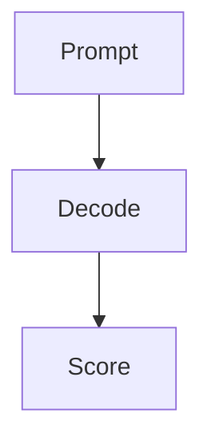

# S-INGEST + S-STATE (Foundation) Implementation Plan

> **For agentic workers:** REQUIRED SUB-SKILL: Use superpowers:subagent-driven-development (recommended) or superpowers:executing-plans to implement this plan task-by-task. Steps use checkbox (`- [ ]`) syntax for tracking.

**Goal:** Build the foundation of the LLM Tutor app — the Next.js + TypeScript scaffold, the `CurriculumRepository` that parses read-only markdown into the typed `Curriculum` model (S-INGEST), and the JSON-sidecar `StateStore` with the pure mastery-transition and spaced-repetition functions (S-STATE).

**Architecture:** A Next.js 15 App Router app at `~/llm-tutor`. S-INGEST reads `*.md` from `CURRICULUM_DIR` (read-only), splitting each note on the exact headings in build-spec §2.2 via `gray-matter` (frontmatter) + `unified`/`remark` (body), producing `Module` / `Curriculum`. S-STATE owns `_llmtutor-state.json` (the single source of truth): read-with-default, atomic temp-file + rename writes, and pure functions (`nextMastery`, SR interval logic) that are trivially unit-testable. The app NEVER writes to `.md`. All shared types come from `00-shared-model.md` §2–§6, copied verbatim into `src/lib/types.ts`.

**Tech Stack:** Next.js 15 · TypeScript (strict) · `gray-matter` · `unified` + `remark-parse` · `vitest` · Node `fs/promises`.

---

## Shared-model additions needed

The plan surfaced three things underspecified in `00-shared-model.md`. None are invented silently below — each is handled explicitly and flagged here for a follow-up edit to the shared model:

1. **SR interval function has no exported signature.** §5 describes the SR rule in prose ("resurfaces when `now - lastTested ≥ intervalDays`; correct → 7→14→30 cap; miss → reset to 7") but exports no function. This plan introduces two pure helpers in `src/lib/state/sr.ts` — `isCardDue(card, now)` and `nextSrInterval(card, recall)` — and recommends promoting their signatures into shared-model §5.

2. **`nextMastery` references drill self-marking, which `ModuleState` does not store.** §5's fuzzy→solid rule requires "a drill self-marked adequate," but `ModuleState` has no field for it. To keep `nextMastery` pure and to avoid inventing a schema field that S-SELF (plan-03) properly owns, this plan gives `nextMastery` an explicit `readPasses: DepthPass[]` argument (already in the signature) **and** a `drillAdequate: boolean` argument. Recommend adding `drillAdequate` to the shared signature, or adding a `drills: { adequate: boolean }` field to `ModuleState` in a later plan. Flagged, not silently changed.

3. **"hard MCQs correct in all 4 dimensions" needs a concrete read of the matrix.** §7 / §5 say solid→verified requires hard-difficulty MCQs correct in all four dimensions. The matrix stores `{seen, correct}` per `(difficulty, dimension)` cell; this plan defines "hard correct in a dimension" as `matrix.hard[dim].correct >= 1` (at least one hard question answered correctly in that dimension). This is the literal reading of build-spec §7 ("clear HARD MCQs across all 4 dimensions"); noted so a later plan can tighten the threshold if desired.

---

## File structure

| File | Responsibility |
|---|---|
| `~/llm-tutor/package.json` | deps + `dev`/`test` scripts |
| `~/llm-tutor/tsconfig.json` | TS strict config (Next.js default + strict) |
| `~/llm-tutor/next.config.ts` | minimal Next config |
| `~/llm-tutor/vitest.config.ts` | Vitest config (node env, globals) |
| `~/llm-tutor/.env.local.example` | documents `CURRICULUM_DIR` |
| `~/llm-tutor/app/page.tsx` | placeholder home route (proves Next builds) |
| `~/llm-tutor/src/lib/types.ts` | ALL shared interfaces copied from 00-shared-model §2–§6 |
| `~/llm-tutor/src/lib/__tests__/smoke.test.ts` | trivial test proving the harness runs |
| `~/llm-tutor/src/lib/ingest/parse-module.ts` | pure: markdown string → `Module` |
| `~/llm-tutor/src/lib/ingest/repository.ts` | `CurriculumRepository` impl: read dir → `Curriculum` |
| `~/llm-tutor/src/lib/ingest/__tests__/fixtures/B01-sample.md` | trimmed fixture module |
| `~/llm-tutor/src/lib/ingest/__tests__/parse-module.test.ts` | parser unit tests |
| `~/llm-tutor/src/lib/ingest/__tests__/repository.test.ts` | repository tests against a temp dir |
| `~/llm-tutor/src/lib/state/defaults.ts` | pure: `defaultTutorState()`, `defaultModuleState()` |
| `~/llm-tutor/src/lib/state/mastery.ts` | pure: `nextMastery(...)` |
| `~/llm-tutor/src/lib/state/sr.ts` | pure: `isCardDue`, `nextSrInterval` |
| `~/llm-tutor/src/lib/state/store.ts` | `StateStore` impl over the JSON sidecar (atomic write) |
| `~/llm-tutor/src/lib/state/__tests__/mastery.test.ts` | mastery-transition tests (correctness core) |
| `~/llm-tutor/src/lib/state/__tests__/sr.test.ts` | SR interval tests (correctness core) |
| `~/llm-tutor/src/lib/state/__tests__/store.test.ts` | store read/write/atomicity tests |

---

## Task 1: Scaffold the project + prove the test harness runs

**Files:**
- Create: `~/llm-tutor/package.json`
- Create: `~/llm-tutor/tsconfig.json`
- Create: `~/llm-tutor/next.config.ts`
- Create: `~/llm-tutor/vitest.config.ts`
- Create: `~/llm-tutor/.env.local.example`
- Create: `~/llm-tutor/app/page.tsx`
- Create: `~/llm-tutor/src/lib/__tests__/smoke.test.ts`

- [ ] **Step 1: Create `package.json`**

```json
{
  "name": "llm-tutor",
  "version": "0.1.0",
  "private": true,
  "type": "module",
  "scripts": {
    "dev": "next dev",
    "build": "next build",
    "start": "next start",
    "test": "vitest run",
    "test:watch": "vitest",
    "typecheck": "tsc --noEmit"
  },
  "dependencies": {
    "gray-matter": "^4.0.3",
    "next": "^15.1.0",
    "react": "^19.0.0",
    "react-dom": "^19.0.0",
    "remark-parse": "^11.0.0",
    "unified": "^11.0.5"
  },
  "devDependencies": {
    "@types/node": "^22.10.0",
    "@types/react": "^19.0.0",
    "@types/react-dom": "^19.0.0",
    "typescript": "^5.7.0",
    "vitest": "^3.0.0"
  }
}
```

- [ ] **Step 2: Create `tsconfig.json` (strict)**

```json
{
  "compilerOptions": {
    "target": "ES2022",
    "lib": ["dom", "dom.iterable", "ES2022"],
    "allowJs": false,
    "skipLibCheck": true,
    "strict": true,
    "noEmit": true,
    "esModuleInterop": true,
    "module": "esnext",
    "moduleResolution": "bundler",
    "resolveJsonModule": true,
    "isolatedModules": true,
    "jsx": "preserve",
    "incremental": true,
    "plugins": [{ "name": "next" }],
    "baseUrl": ".",
    "paths": { "@/*": ["./src/*"] }
  },
  "include": ["next-env.d.ts", "**/*.ts", "**/*.tsx", ".next/types/**/*.ts"],
  "exclude": ["node_modules"]
}
```

- [ ] **Step 3: Create `next.config.ts`**

```ts
import type { NextConfig } from 'next';

const nextConfig: NextConfig = {};

export default nextConfig;
```

- [ ] **Step 4: Create `vitest.config.ts`**

```ts
import { defineConfig } from 'vitest/config';
import { resolve } from 'node:path';

export default defineConfig({
  test: {
    globals: true,
    environment: 'node',
    include: ['src/**/*.test.ts'],
  },
  resolve: {
    alias: { '@': resolve(__dirname, './src') },
  },
});
```

- [ ] **Step 5: Create `.env.local.example`**

```bash
# Absolute path to the read-only curriculum folder (Obsidian LLM-Curriculum).
# The app reads *.md and mcq/*.json from here and owns _llmtutor-state.json here.
CURRICULUM_DIR=/Users/unmukt/Obsidian/Trustevals/Trustevals/LLM-Curriculum
```

- [ ] **Step 6: Create `app/page.tsx` (placeholder home route)**

```tsx
export default function Home() {
  return (
    <main>
      <h1>LLM Tutor</h1>
      <p>Foundation scaffold. Map and reader land in plan-02.</p>
    </main>
  );
}
```

- [ ] **Step 7: Create the smoke test `src/lib/__tests__/smoke.test.ts`**

```ts
import { describe, it, expect } from 'vitest';

describe('test harness', () => {
  it('runs', () => {
    expect(1 + 1).toBe(2);
  });
});
```

- [ ] **Step 8: Install dependencies**

Run: `cd /Users/unmukt/llm-tutor && npm install`
Expected: dependencies install, `node_modules/` created, `package-lock.json` written, exit 0.

- [ ] **Step 9: Run the smoke test to verify the harness works**

Run: `cd /Users/unmukt/llm-tutor && npm test`
Expected: PASS — 1 passing test (`test harness > runs`).

- [ ] **Step 10: Commit**

```bash
cd /Users/unmukt/llm-tutor
git add package.json package-lock.json tsconfig.json next.config.ts vitest.config.ts .env.local.example app/page.tsx src/lib/__tests__/smoke.test.ts
git commit -m "chore: scaffold Next.js + TS + vitest harness with passing smoke test

Co-Authored-By: Claude Opus 4.7 (1M context) <noreply@anthropic.com>"
```

---

## Task 2: Add the shared type contract (`src/lib/types.ts`)

**Files:**
- Create: `~/llm-tutor/src/lib/types.ts`
- Test: `~/llm-tutor/src/lib/__tests__/types.test.ts`

- [ ] **Step 1: Write the failing test `src/lib/__tests__/types.test.ts`**

This test compile-checks that the key shared types exist and have the documented shape. It constructs minimal literals typed as the shared interfaces — if a field is missing or misnamed, `tsc` (run via `npm run typecheck`) fails; the runtime assertions confirm the values too.

```ts
import { describe, it, expect } from 'vitest';
import type {
  TrackId,
  DepthPass,
  Drill,
  StressTest,
  Module,
  Curriculum,
  Difficulty,
  Dimension,
  MCQQuestion,
  MCQPool,
  Cell,
  PerformanceMatrix,
  DimensionStatus,
  DimensionProfile,
  Diagnosis,
  ChosenDistractor,
  Mastery,
  ModuleState,
  FlashcardState,
  TutorState,
} from '@/lib/types';

describe('shared types', () => {
  it('Module has the contract shape', () => {
    const m: Module = {
      id: 'B01',
      track: 'B',
      name: 'Eval harnesses',
      prerequisites: ['M03'],
      primarySources: ['S4'],
      whyThisMatters: 'because',
      anchors: ['a scenario'],
      passes: { engineer: 'body' },
      diagrams: ['graph TD; A-->B'],
      drills: [{ scenario: 's' }],
      stressTests: [{ lens: 'board', question: 'q' }],
      flashcardSeeds: ['seed'],
      sources: ['S4 — title'],
    };
    expect(m.id).toBe('B01');
    expect(m.passes.engineer).toBe('body');
  });

  it('TutorState nests ModuleState with the mcq matrix', () => {
    const cell: Cell = { seen: 1, correct: 1 };
    const matrix: PerformanceMatrix = {
      easy: {},
      medium: { logic: cell },
      hard: {},
    };
    const profile: DimensionProfile = {
      topic: 'untested',
      logic: 'solid',
      example: 'untested',
      extension: 'untested',
    };
    const ms: ModuleState = {
      mastery: 'fuzzy',
      masteryHistory: [{ level: 'fuzzy', at: 'now', via: 'mcq' }],
      mcq: {
        matrix,
        distractorLog: [{ qid: 'B01-q1', chose: 2, at: 'now' }],
        dimensionProfile: profile,
      },
      stressTest: { board: 'untested' },
    };
    const state: TutorState = {
      version: 1,
      modules: { B01: ms },
      flashcards: { 'B01-c01': { lastTested: 'now', intervalDays: 7, ease: 'good' } },
      xp: { total: 0, thisWeek: 0 },
      streak: { count: 0, lastActive: 'now', freezeTokens: 1 },
      sessionLog: [],
    };
    expect(state.modules.B01.mcq.matrix.medium.logic?.correct).toBe(1);
  });
});
```

- [ ] **Step 2: Run test to verify it fails**

Run: `cd /Users/unmukt/llm-tutor && npm test -- src/lib/__tests__/types.test.ts`
Expected: FAIL — cannot resolve module `@/lib/types` (file does not exist yet).

- [ ] **Step 3: Create `src/lib/types.ts` (verbatim from 00-shared-model §2–§6)**

```ts
// All shared types for the LLM Tutor. Copied from docs/plans/00-shared-model.md §2–§6.
// DO NOT redefine these locally in other modules. If a new shared type is needed,
// add it to 00-shared-model.md first, then here.

// ── §2 Curriculum domain types (S-INGEST output) ─────────────────────────────
export type TrackId = 'A' | 'B' | 'C';
export type DepthPass = 'tenYearOld' | 'engineer' | 'operator';

export interface Drill {
  scenario: string;
  dc1?: string;
  dc2?: string;
}
export interface StressTest {
  lens: 'board' | 'researcher' | 'analyst';
  question: string;
}

export interface Module {
  id: string; // "B01" (frontmatter module_id) — stable key everywhere
  track: TrackId;
  name: string;
  prerequisites: string[]; // ["M03","M04"] → soft-lock edges
  primarySources: string[]; // ["S4","S5"] → resolved against _sources.md
  whyThisMatters: string; // "## Why this matters" (required; absent → flag)
  anchors: string[]; // "## Anchor scenarios"
  passes: Partial<Record<DepthPass, string>>; // ### 10-year-old / Engineer / Operator
  diagrams: string[]; // fenced mermaid/ascii blocks from the engineer pass
  labSpec?: string; // "## Lab spec"
  drills: Drill[]; // "## Application drills"
  stressTests: StressTest[]; // "## Stress-test pool"
  flashcardSeeds: string[]; // "## Flashcard seeds"
  sources: string[]; // "## Sources" lines
}

export interface Curriculum {
  tracks: TrackId[];
  modules: Module[]; // ordered
  byId(id: string): Module | undefined;
}

export interface CurriculumRepository {
  load(dir: string): Promise<Curriculum>; // parse all *.md in CURRICULUM_DIR
}

// ── §3 Assessment / diagnostic types (S-MCQ) ─────────────────────────────────
export type Difficulty = 'easy' | 'medium' | 'hard';
export type Dimension = 'topic' | 'logic' | 'example' | 'extension';

export interface MCQQuestion {
  id: string; // "B01-q014"
  moduleId: string;
  difficulty: Difficulty;
  dimension: Dimension;
  stem: string;
  options: string[]; // length 4
  correctIndex: number; // 0..3
  distractorMisconception: Record<string, string>; // optionIndex → misconception (required)
  explanation: string;
  sourceRef?: string; // "S4"
}
export interface MCQPool {
  moduleId: string;
  questions: MCQQuestion[];
}

export interface MCQRepository {
  loadPool(moduleId: string): Promise<MCQPool | null>;
}

export interface AssessmentSpec {
  moduleId: string;
  count: number; // default 6
}

export interface MCQAnswer {
  questionId: string;
  chosenIndex: number;
  correct: boolean;
  at: string;
}

export type Cell = { seen: number; correct: number };
export type PerformanceMatrix = Record<Difficulty, Partial<Record<Dimension, Cell>>>;

export type DimensionStatus = 'solid' | 'fuzzy' | 'weak' | 'untested';
export type DimensionProfile = Record<Dimension, DimensionStatus>;
export type ChosenDistractor = { qid: string; chose: number; at: string };

export interface Diagnosis {
  dimension: Dimension; // the localized failing bucket
  confidence: number; // = accuracy gap (0..1), NOT a model score
  evidence: { qids: string[]; recurringMisconceptions: string[] };
  remediation: DepthPass | 'lab' | 'drill'; // routing target (build-spec §3.1)
}

// ── §5 Sidecar state (S-STATE — SINGLE SOURCE OF TRUTH) ──────────────────────
export type Mastery = 'blank' | 'fuzzy' | 'solid' | 'verified';

export interface ModuleState {
  mastery: Mastery;
  masteryHistory: { level: Mastery; at: string; via: string }[];
  mcq: {
    matrix: PerformanceMatrix;
    distractorLog: ChosenDistractor[];
    dimensionProfile: DimensionProfile;
    openDiagnosis?: Diagnosis & { openedAt: string };
  };
  stressTest: Partial<Record<'board' | 'researcher' | 'analyst', 'passed' | 'not_yet' | 'untested'>>;
}

export interface FlashcardState {
  lastTested: string;
  intervalDays: 7 | 14 | 30;
  ease: 'again' | 'good';
}

export interface TutorState {
  version: 1;
  modules: Record<string, ModuleState>; // keyed by Module.id
  flashcards: Record<string, FlashcardState>; // keyed by card id from _flashcards.md
  xp: { total: number; thisWeek: number };
  streak: { count: number; lastActive: string; freezeTokens: number };
  sessionLog: { module: string; at: string; events: string[] }[];
}

export interface StateStore {
  read(): Promise<TutorState>; // creates default if missing
  write(s: TutorState): Promise<void>; // atomic write (temp + rename)
  getModule(id: string): Promise<ModuleState>; // default if absent
}
```

- [ ] **Step 4: Run test to verify it passes**

Run: `cd /Users/unmukt/llm-tutor && npm test -- src/lib/__tests__/types.test.ts && npm run typecheck`
Expected: PASS — 2 passing tests; `tsc --noEmit` exits 0 (no type errors).

- [ ] **Step 5: Commit**

```bash
cd /Users/unmukt/llm-tutor
git add src/lib/types.ts src/lib/__tests__/types.test.ts
git commit -m "feat(types): add shared type contract from 00-shared-model

Co-Authored-By: Claude Opus 4.7 (1M context) <noreply@anthropic.com>"
```

---

## Task 3: Add the test fixture module

**Files:**
- Create: `~/llm-tutor/src/lib/ingest/__tests__/fixtures/B01-sample.md`

This is a trimmed but contract-complete module used by all S-INGEST tests. It deliberately includes: frontmatter, all three depth passes, a `## Why this matters`, anchors, a fenced ```mermaid block AND a fenced ```text ASCII block inside the engineer pass, two drills (scenario + DC1/DC2), three stress-test lenses, flashcard seeds, and sources. Tests must NOT read the real Obsidian folder.

- [ ] **Step 1: Create the fixture `src/lib/ingest/__tests__/fixtures/B01-sample.md`**

````markdown
---
module_id: B01
track: B
name: Eval harnesses & harness engineering
prerequisites: [M03, M04]
primary_sources: [S4, S5]
---

# Eval harnesses & harness engineering

## Why this matters

If your harness is wrong, every score downstream is a confident lie.

## Anchor scenarios

You ship a model and the eval says 92%; production says 60%.
The board asks why the number moved.

### 10-year-old pass

A test is only fair if everyone takes the same test the same way.

### Engineer pass

A harness pins prompts, decoding, and scoring so score deltas mean capability deltas.



```text
[prompt] -> [decode] -> [score]
```

### Operator pass

If you cannot defend the harness to an auditor, you cannot defend the number.

## Lab spec

Build a harness that pins temperature=0 and logs every prompt hash.

## Application drills

### Drill 1
Scenario: Your eval set leaked into training. What breaks and how do you detect it?
DC1: Distinguish contamination from genuine capability gain.
DC2: Propose a contamination probe that does not need the training set.

### Drill 2
Scenario: Two runs of the same model score differently.
DC1: List three nondeterminism sources.

## Stress-test pool

- board: Defend why this eval number is decision-grade.
- researcher: Argue the harness has no construct-validity leak.
- analyst: Reconcile the eval number with the production number.

## Flashcard seeds

- What makes an eval "fair"? :: Invariance to nuisance factors.
- Define construct validity. :: The eval measures the intended capability.

## Sources

- S4 — Construct validity in evals
- S5 — Harness determinism
````

- [ ] **Step 2: Commit (no test yet; fixture is consumed by Task 4)**

```bash
cd /Users/unmukt/llm-tutor
git add src/lib/ingest/__tests__/fixtures/B01-sample.md
git commit -m "test(ingest): add trimmed contract-complete B01 fixture module

Co-Authored-By: Claude Opus 4.7 (1M context) <noreply@anthropic.com>"
```

---

## Task 4: Parse frontmatter + module identity + whyThisMatters

**Files:**
- Create: `~/llm-tutor/src/lib/ingest/parse-module.ts`
- Test: `~/llm-tutor/src/lib/ingest/__tests__/parse-module.test.ts`

- [ ] **Step 1: Write the failing test `src/lib/ingest/__tests__/parse-module.test.ts`**

```ts
import { describe, it, expect, beforeAll } from 'vitest';
import { readFile } from 'node:fs/promises';
import { resolve } from 'node:path';
import { parseModule } from '@/lib/ingest/parse-module';
import type { Module } from '@/lib/types';

const FIXTURE = resolve(__dirname, 'fixtures/B01-sample.md');

describe('parseModule — identity + whyThisMatters', () => {
  let mod: Module;
  beforeAll(async () => {
    mod = parseModule(await readFile(FIXTURE, 'utf8'));
  });

  it('reads frontmatter into id/track/name', () => {
    expect(mod.id).toBe('B01');
    expect(mod.track).toBe('B');
    expect(mod.name).toBe('Eval harnesses & harness engineering');
  });

  it('reads prerequisites and primary sources', () => {
    expect(mod.prerequisites).toEqual(['M03', 'M04']);
    expect(mod.primarySources).toEqual(['S4', 'S5']);
  });

  it('captures why-this-matters text', () => {
    expect(mod.whyThisMatters).toContain('every score downstream is a confident lie');
  });

  it('does not throw and leaves whyThisMatters empty string when section absent', () => {
    const noWhy = parseModule('---\nmodule_id: X01\ntrack: A\nname: X\n---\n\n## Sources\n- S1\n');
    expect(noWhy.whyThisMatters).toBe('');
    expect(noWhy.id).toBe('X01');
  });
});
```

> Note on the contract: shared-model §2 types `whyThisMatters: string` (not optional). build-spec §2.2 says missing → "stake not authored" warning. We represent "absent" as the empty string `''` (the reader treats empty as the warning condition). All other absent sections that the type allows to be absent use `undefined` (e.g. `labSpec`).

- [ ] **Step 2: Run test to verify it fails**

Run: `cd /Users/unmukt/llm-tutor && npm test -- src/lib/ingest/__tests__/parse-module.test.ts`
Expected: FAIL — cannot resolve `@/lib/ingest/parse-module`.

- [ ] **Step 3: Write minimal implementation `src/lib/ingest/parse-module.ts`**

```ts
import matter from 'gray-matter';
import type { Module, TrackId } from '@/lib/types';

/**
 * Split markdown body into a map keyed by exact heading text (without the `#`s).
 * Returns the raw text under each heading (trimmed), for both ## and ### levels.
 * The first key is '' (preamble before any heading), which we ignore.
 */
function sectionsByHeading(body: string): Map<string, string> {
  const lines = body.split('\n');
  const sections = new Map<string, string>();
  let currentHeading = '';
  let buffer: string[] = [];
  let inFence = false;

  const flush = () => {
    if (currentHeading) sections.set(currentHeading, buffer.join('\n').trim());
    buffer = [];
  };

  for (const line of lines) {
    if (line.trimStart().startsWith('```')) inFence = !inFence;
    const headingMatch = !inFence ? /^(#{2,3})\s+(.*)$/.exec(line) : null;
    if (headingMatch) {
      flush();
      currentHeading = headingMatch[2].trim();
    } else {
      buffer.push(line);
    }
  }
  flush();
  return sections;
}

function asStringArray(v: unknown): string[] {
  if (Array.isArray(v)) return v.map((x) => String(x));
  if (v === undefined || v === null) return [];
  return [String(v)];
}

export function parseModule(raw: string): Module {
  const { data, content } = matter(raw);
  const sections = sectionsByHeading(content);

  const id = String(data.module_id ?? '');
  const track = (String(data.track ?? 'A') as TrackId);
  const name = String(data.name ?? '');

  return {
    id,
    track,
    name,
    prerequisites: asStringArray(data.prerequisites),
    primarySources: asStringArray(data.primary_sources),
    whyThisMatters: sections.get('Why this matters') ?? '',
    anchors: [],
    passes: {},
    diagrams: [],
    labSpec: undefined,
    drills: [],
    stressTests: [],
    flashcardSeeds: [],
    sources: [],
  };
}
```

- [ ] **Step 4: Run test to verify it passes**

Run: `cd /Users/unmukt/llm-tutor && npm test -- src/lib/ingest/__tests__/parse-module.test.ts`
Expected: PASS — 4 passing tests.

- [ ] **Step 5: Commit**

```bash
cd /Users/unmukt/llm-tutor
git add src/lib/ingest/parse-module.ts src/lib/ingest/__tests__/parse-module.test.ts
git commit -m "feat(ingest): parse frontmatter identity + whyThisMatters (absent → '')

Co-Authored-By: Claude Opus 4.7 (1M context) <noreply@anthropic.com>"
```

---

## Task 5: Parse the three depth passes + anchors + lab spec

**Files:**
- Modify: `~/llm-tutor/src/lib/ingest/parse-module.ts`
- Test: `~/llm-tutor/src/lib/ingest/__tests__/parse-module.test.ts` (append a describe block)

- [ ] **Step 1: Append failing tests to `parse-module.test.ts`**

Add this block after the existing `describe(...)` (keep the existing imports and `FIXTURE`/`beforeAll` available by adding a fresh local load inside this block):

```ts
describe('parseModule — passes, anchors, lab spec', () => {
  let mod: Module;
  beforeAll(async () => {
    mod = parseModule(await readFile(FIXTURE, 'utf8'));
  });

  it('maps the three depth passes to the canonical keys', () => {
    expect(mod.passes.tenYearOld).toContain('everyone takes the same test');
    expect(mod.passes.engineer).toContain('pins prompts, decoding, and scoring');
    expect(mod.passes.operator).toContain('defend the harness to an auditor');
  });

  it('captures anchors as a non-empty entry', () => {
    expect(mod.anchors.length).toBe(1);
    expect(mod.anchors[0]).toContain('the eval says 92%');
  });

  it('captures the lab spec text', () => {
    expect(mod.labSpec).toContain('temperature=0');
  });

  it('leaves passes undefined when a pass heading is absent', () => {
    const partial = parseModule(
      '---\nmodule_id: Y01\ntrack: A\nname: Y\n---\n\n### Engineer pass\nonly engineer here\n',
    );
    expect(partial.passes.engineer).toBe('only engineer here');
    expect(partial.passes.tenYearOld).toBeUndefined();
    expect(partial.passes.operator).toBeUndefined();
    expect(partial.labSpec).toBeUndefined();
  });
});
```

- [ ] **Step 2: Run test to verify it fails**

Run: `cd /Users/unmukt/llm-tutor && npm test -- src/lib/ingest/__tests__/parse-module.test.ts`
Expected: FAIL — passes/anchors/labSpec assertions fail (current impl returns empty `passes`, empty `anchors`, `labSpec: undefined`).

- [ ] **Step 3: Update `parse-module.ts` to populate passes, anchors, lab spec**

Replace the `return { ... }` block in `parseModule` with the version below (the helper functions and `sectionsByHeading` stay as they are; add the `passes` assembly above the return):

```ts
export function parseModule(raw: string): Module {
  const { data, content } = matter(raw);
  const sections = sectionsByHeading(content);

  const id = String(data.module_id ?? '');
  const track = (String(data.track ?? 'A') as TrackId);
  const name = String(data.name ?? '');

  const passes: Module['passes'] = {};
  const tenYearOld = sections.get('10-year-old pass');
  const engineer = sections.get('Engineer pass');
  const operator = sections.get('Operator pass');
  if (tenYearOld !== undefined) passes.tenYearOld = tenYearOld;
  if (engineer !== undefined) passes.engineer = engineer;
  if (operator !== undefined) passes.operator = operator;

  const anchorsText = sections.get('Anchor scenarios');
  const anchors = anchorsText ? [anchorsText] : [];

  return {
    id,
    track,
    name,
    prerequisites: asStringArray(data.prerequisites),
    primarySources: asStringArray(data.primary_sources),
    whyThisMatters: sections.get('Why this matters') ?? '',
    anchors,
    passes,
    diagrams: [],
    labSpec: sections.get('Lab spec'),
    drills: [],
    stressTests: [],
    flashcardSeeds: [],
    sources: [],
  };
}
```

- [ ] **Step 4: Run test to verify it passes**

Run: `cd /Users/unmukt/llm-tutor && npm test -- src/lib/ingest/__tests__/parse-module.test.ts`
Expected: PASS — all 8 tests pass.

- [ ] **Step 5: Commit**

```bash
cd /Users/unmukt/llm-tutor
git add src/lib/ingest/parse-module.ts src/lib/ingest/__tests__/parse-module.test.ts
git commit -m "feat(ingest): parse 3 depth passes, anchors, lab spec (absent → undefined)

Co-Authored-By: Claude Opus 4.7 (1M context) <noreply@anthropic.com>"
```

---

## Task 6: Extract fenced mermaid/ASCII diagrams from the engineer pass

**Files:**
- Modify: `~/llm-tutor/src/lib/ingest/parse-module.ts`
- Test: `~/llm-tutor/src/lib/ingest/__tests__/parse-module.test.ts` (append)

- [ ] **Step 1: Append failing test**

```ts
describe('parseModule — diagram extraction', () => {
  let mod: Module;
  beforeAll(async () => {
    mod = parseModule(await readFile(FIXTURE, 'utf8'));
  });

  it('pulls both the mermaid and ascii fenced blocks from the engineer pass', () => {
    expect(mod.diagrams.length).toBe(2);
    expect(mod.diagrams[0]).toContain('graph TD');
    expect(mod.diagrams[0]).toContain('Prompt --> Decode --> Score');
    expect(mod.diagrams[1]).toContain('[prompt] -> [decode] -> [score]');
  });

  it('returns no diagrams when the engineer pass has none', () => {
    const noDiag = parseModule(
      '---\nmodule_id: Z01\ntrack: A\nname: Z\n---\n\n### Engineer pass\nprose only, no fences\n',
    );
    expect(noDiag.diagrams).toEqual([]);
  });
});
```

- [ ] **Step 2: Run test to verify it fails**

Run: `cd /Users/unmukt/llm-tutor && npm test -- src/lib/ingest/__tests__/parse-module.test.ts`
Expected: FAIL — `mod.diagrams` is `[]` (length 0, expected 2).

- [ ] **Step 3: Add the diagram extractor and wire it in**

Add this helper near the top of `parse-module.ts` (after `asStringArray`):

```ts
/**
 * Extract the contents of fenced code blocks whose language is mermaid, ascii,
 * or text (the diagram languages used in the engineer pass). Returns the inner
 * text of each matching block, in document order.
 */
function extractDiagrams(passText: string | undefined): string[] {
  if (!passText) return [];
  const out: string[] = [];
  const lines = passText.split('\n');
  let inDiagram = false;
  let buffer: string[] = [];
  for (const line of lines) {
    const fence = /^```(\w*)\s*$/.exec(line.trimStart());
    if (fence) {
      const lang = fence[1].toLowerCase();
      if (!inDiagram && (lang === 'mermaid' || lang === 'ascii' || lang === 'text')) {
        inDiagram = true;
        buffer = [];
      } else if (inDiagram) {
        out.push(buffer.join('\n').trim());
        inDiagram = false;
      }
      continue;
    }
    if (inDiagram) buffer.push(line);
  }
  return out;
}
```

Then in `parseModule`, change the `diagrams: []` line to:

```ts
    diagrams: extractDiagrams(passes.engineer),
```

(Place this after `passes` is assembled — it already is, since `passes` is built before the `return`.)

- [ ] **Step 4: Run test to verify it passes**

Run: `cd /Users/unmukt/llm-tutor && npm test -- src/lib/ingest/__tests__/parse-module.test.ts`
Expected: PASS — all 10 tests pass.

- [ ] **Step 5: Commit**

```bash
cd /Users/unmukt/llm-tutor
git add src/lib/ingest/parse-module.ts src/lib/ingest/__tests__/parse-module.test.ts
git commit -m "feat(ingest): extract fenced mermaid/ascii diagrams from engineer pass

Co-Authored-By: Claude Opus 4.7 (1M context) <noreply@anthropic.com>"
```

---

## Task 7: Parse application drills (scenario + DC1/DC2)

**Files:**
- Modify: `~/llm-tutor/src/lib/ingest/parse-module.ts`
- Test: `~/llm-tutor/src/lib/ingest/__tests__/parse-module.test.ts` (append)

- [ ] **Step 1: Append failing test**

```ts
describe('parseModule — application drills', () => {
  let mod: Module;
  beforeAll(async () => {
    mod = parseModule(await readFile(FIXTURE, 'utf8'));
  });

  it('parses two drills with scenario + double-clicks', () => {
    expect(mod.drills.length).toBe(2);
    expect(mod.drills[0].scenario).toContain('eval set leaked into training');
    expect(mod.drills[0].dc1).toContain('Distinguish contamination');
    expect(mod.drills[0].dc2).toContain('contamination probe');
  });

  it('handles a drill with only dc1 (dc2 undefined)', () => {
    expect(mod.drills[1].scenario).toContain('Two runs of the same model');
    expect(mod.drills[1].dc1).toContain('three nondeterminism sources');
    expect(mod.drills[1].dc2).toBeUndefined();
  });

  it('returns no drills when the section is absent', () => {
    const noDrills = parseModule('---\nmodule_id: D01\ntrack: A\nname: D\n---\n\n## Sources\n- S1\n');
    expect(noDrills.drills).toEqual([]);
  });
});
```

- [ ] **Step 2: Run test to verify it fails**

Run: `cd /Users/unmukt/llm-tutor && npm test -- src/lib/ingest/__tests__/parse-module.test.ts`
Expected: FAIL — `mod.drills` is `[]`.

- [ ] **Step 3: Add the drill parser and wire it in**

The fixture's drills live under `## Application drills`, each as a `### Drill N` block with `Scenario:` / `DC1:` / `DC2:` lines. Because `sectionsByHeading` already splits on `###`, the `### Drill 1` / `### Drill 2` headings each become their own section. Add a parser that scans all `### Drill*` sections.

Add this helper to `parse-module.ts`:

```ts
import type { Drill } from '@/lib/types';

function parseDrills(sections: Map<string, string>): Drill[] {
  const drills: Drill[] = [];
  for (const [heading, text] of sections) {
    if (!/^Drill\b/i.test(heading)) continue;
    const grab = (label: string): string | undefined => {
      const re = new RegExp(`^${label}:\\s*(.*)$`, 'im');
      const match = re.exec(text);
      return match ? match[1].trim() : undefined;
    };
    const scenario = grab('Scenario') ?? '';
    const drill: Drill = { scenario };
    const dc1 = grab('DC1');
    const dc2 = grab('DC2');
    if (dc1 !== undefined) drill.dc1 = dc1;
    if (dc2 !== undefined) drill.dc2 = dc2;
    drills.push(drill);
  }
  return drills;
}
```

> Update the existing `import type { Module, TrackId } from '@/lib/types';` line to also import `Drill`, OR keep a separate `import type { Drill } from '@/lib/types';` as shown. Use one import line: `import type { Module, TrackId, Drill } from '@/lib/types';`.

Then in `parseModule`, change `drills: []` to:

```ts
    drills: parseDrills(sections),
```

- [ ] **Step 4: Run test to verify it passes**

Run: `cd /Users/unmukt/llm-tutor && npm test -- src/lib/ingest/__tests__/parse-module.test.ts`
Expected: PASS — all 13 tests pass.

- [ ] **Step 5: Commit**

```bash
cd /Users/unmukt/llm-tutor
git add src/lib/ingest/parse-module.ts src/lib/ingest/__tests__/parse-module.test.ts
git commit -m "feat(ingest): parse application drills (scenario + DC1/DC2)

Co-Authored-By: Claude Opus 4.7 (1M context) <noreply@anthropic.com>"
```

---

## Task 8: Parse stress tests (3 lenses), flashcard seeds, and sources

**Files:**
- Modify: `~/llm-tutor/src/lib/ingest/parse-module.ts`
- Test: `~/llm-tutor/src/lib/ingest/__tests__/parse-module.test.ts` (append)

- [ ] **Step 1: Append failing test**

```ts
describe('parseModule — stress tests, flashcards, sources', () => {
  let mod: Module;
  beforeAll(async () => {
    mod = parseModule(await readFile(FIXTURE, 'utf8'));
  });

  it('parses three stress-test lenses', () => {
    expect(mod.stressTests.length).toBe(3);
    expect(mod.stressTests.map((s) => s.lens)).toEqual(['board', 'researcher', 'analyst']);
    expect(mod.stressTests[0].question).toContain('decision-grade');
    expect(mod.stressTests[2].question).toContain('production number');
  });

  it('parses flashcard seeds as lines', () => {
    expect(mod.flashcardSeeds.length).toBe(2);
    expect(mod.flashcardSeeds[0]).toContain('What makes an eval');
  });

  it('parses sources as lines', () => {
    expect(mod.sources.length).toBe(2);
    expect(mod.sources[0]).toContain('S4 — Construct validity');
  });

  it('returns empty arrays when those sections are absent', () => {
    const bare = parseModule('---\nmodule_id: E01\ntrack: A\nname: E\n---\n\n## Why this matters\nx\n');
    expect(bare.stressTests).toEqual([]);
    expect(bare.flashcardSeeds).toEqual([]);
    expect(bare.sources).toEqual([]);
  });
});
```

- [ ] **Step 2: Run test to verify it fails**

Run: `cd /Users/unmukt/llm-tutor && npm test -- src/lib/ingest/__tests__/parse-module.test.ts`
Expected: FAIL — `stressTests`, `flashcardSeeds`, `sources` are all `[]`.

- [ ] **Step 3: Add the three parsers and wire them in**

Add these helpers to `parse-module.ts` (update the type import line to include `StressTest`: `import type { Module, TrackId, Drill, StressTest } from '@/lib/types';`):

```ts
const STRESS_LENSES: StressTest['lens'][] = ['board', 'researcher', 'analyst'];

function parseStressTests(section: string | undefined): StressTest[] {
  if (!section) return [];
  const out: StressTest[] = [];
  for (const raw of section.split('\n')) {
    const line = raw.replace(/^\s*[-*]\s*/, '').trim();
    const match = /^(board|researcher|analyst):\s*(.*)$/i.exec(line);
    if (match) {
      out.push({ lens: match[1].toLowerCase() as StressTest['lens'], question: match[2].trim() });
    }
  }
  return out;
}

function parseBulletLines(section: string | undefined): string[] {
  if (!section) return [];
  return section
    .split('\n')
    .map((l) => l.replace(/^\s*[-*]\s*/, '').trim())
    .filter((l) => l.length > 0);
}
```

> `STRESS_LENSES` documents the canonical order; tests assert order comes from the document, which already matches. It is referenced by name so the linter does not flag it as unused — if your linter still flags it, inline the order assertion instead. (To keep it used, the parser could validate against it; the current parser already only accepts those three lens names via the regex, so the constant is documentation. If unused-var is an error in your config, delete the `STRESS_LENSES` line — it is not load-bearing.)

Then in `parseModule`, change the three lines:

```ts
    stressTests: parseStressTests(sections.get('Stress-test pool')),
    flashcardSeeds: parseBulletLines(sections.get('Flashcard seeds')),
    sources: parseBulletLines(sections.get('Sources')),
```

- [ ] **Step 4: Run test to verify it passes**

Run: `cd /Users/unmukt/llm-tutor && npm test -- src/lib/ingest/__tests__/parse-module.test.ts && npm run typecheck`
Expected: PASS — all 17 tests pass; `tsc` exits 0.

- [ ] **Step 5: Commit**

```bash
cd /Users/unmukt/llm-tutor
git add src/lib/ingest/parse-module.ts src/lib/ingest/__tests__/parse-module.test.ts
git commit -m "feat(ingest): parse stress tests (3 lenses), flashcard seeds, sources

Co-Authored-By: Claude Opus 4.7 (1M context) <noreply@anthropic.com>"
```

---

## Task 9: `CurriculumRepository.load(dir)` — read all `*.md` into a `Curriculum`

**Files:**
- Create: `~/llm-tutor/src/lib/ingest/repository.ts`
- Test: `~/llm-tutor/src/lib/ingest/__tests__/repository.test.ts`

- [ ] **Step 1: Write the failing test `src/lib/ingest/__tests__/repository.test.ts`**

This test writes module markdown into an OS temp dir (NEVER the real Obsidian folder), runs `load`, and asserts the `Curriculum`. It also drops a leading-underscore file (`_sources.md`) and a non-md file to prove they are skipped.

```ts
import { describe, it, expect, beforeAll, afterAll } from 'vitest';
import { mkdtemp, writeFile, rm, mkdir } from 'node:fs/promises';
import { tmpdir } from 'node:os';
import { join } from 'node:path';
import { CurriculumRepositoryImpl } from '@/lib/ingest/repository';

let dir: string;

const MOD_A = `---
module_id: M01
track: A
name: Tokens
prerequisites: []
primary_sources: []
---

## Why this matters
Tokens are the atom.

### Engineer pass
A token is a subword unit.
`;

const MOD_B = `---
module_id: B01
track: B
name: Eval harnesses
prerequisites: [M01]
primary_sources: [S4]
---

## Why this matters
Bad harness, confident lie.

### Engineer pass
Pin everything.
`;

describe('CurriculumRepository.load', () => {
  beforeAll(async () => {
    dir = await mkdtemp(join(tmpdir(), 'llmtutor-curr-'));
    await writeFile(join(dir, 'M01-tokens.md'), MOD_A, 'utf8');
    await writeFile(join(dir, 'B01-harness.md'), MOD_B, 'utf8');
    // these must be ignored:
    await writeFile(join(dir, '_sources.md'), '# sources\n', 'utf8');
    await writeFile(join(dir, '_flashcards.md'), '# cards\n', 'utf8');
    await writeFile(join(dir, 'notes.txt'), 'not markdown', 'utf8');
    await mkdir(join(dir, 'mcq'), { recursive: true });
  });

  afterAll(async () => {
    await rm(dir, { recursive: true, force: true });
  });

  it('loads only real module *.md files (skips _-prefixed and non-md)', async () => {
    const repo = new CurriculumRepositoryImpl();
    const curr = await repo.load(dir);
    const ids = curr.modules.map((m) => m.id).sort();
    expect(ids).toEqual(['B01', 'M01']);
  });

  it('collects distinct tracks in stable order', async () => {
    const repo = new CurriculumRepositoryImpl();
    const curr = await repo.load(dir);
    expect(curr.tracks).toEqual(['A', 'B']);
  });

  it('byId resolves a module and returns undefined for misses', async () => {
    const repo = new CurriculumRepositoryImpl();
    const curr = await repo.load(dir);
    expect(curr.byId('B01')?.name).toBe('Eval harnesses');
    expect(curr.byId('NOPE')).toBeUndefined();
  });

  it('orders modules by filename', async () => {
    const repo = new CurriculumRepositoryImpl();
    const curr = await repo.load(dir);
    // B01-harness.md sorts before M01-tokens.md alphabetically
    expect(curr.modules.map((m) => m.id)).toEqual(['B01', 'M01']);
  });
});
```

- [ ] **Step 2: Run test to verify it fails**

Run: `cd /Users/unmukt/llm-tutor && npm test -- src/lib/ingest/__tests__/repository.test.ts`
Expected: FAIL — cannot resolve `@/lib/ingest/repository`.

- [ ] **Step 3: Write `src/lib/ingest/repository.ts`**

```ts
import { readdir, readFile } from 'node:fs/promises';
import { join } from 'node:path';
import type { Curriculum, CurriculumRepository, Module, TrackId } from '@/lib/types';
import { parseModule } from '@/lib/ingest/parse-module';

function makeCurriculum(modules: Module[]): Curriculum {
  const index = new Map(modules.map((m) => [m.id, m]));
  const tracks = Array.from(new Set(modules.map((m) => m.track))).sort() as TrackId[];
  return {
    tracks,
    modules,
    byId(id: string) {
      return index.get(id);
    },
  };
}

export class CurriculumRepositoryImpl implements CurriculumRepository {
  async load(dir: string): Promise<Curriculum> {
    const entries = await readdir(dir, { withFileTypes: true });
    const files = entries
      .filter((e) => e.isFile())
      .map((e) => e.name)
      .filter((name) => name.endsWith('.md') && !name.startsWith('_'))
      .sort();

    const modules: Module[] = [];
    for (const name of files) {
      const raw = await readFile(join(dir, name), 'utf8');
      const mod = parseModule(raw);
      if (mod.id) modules.push(mod); // skip files without a module_id
    }
    return makeCurriculum(modules);
  }
}
```

- [ ] **Step 4: Run test to verify it passes**

Run: `cd /Users/unmukt/llm-tutor && npm test -- src/lib/ingest/__tests__/repository.test.ts`
Expected: PASS — 4 passing tests.

- [ ] **Step 5: Commit**

```bash
cd /Users/unmukt/llm-tutor
git add src/lib/ingest/repository.ts src/lib/ingest/__tests__/repository.test.ts
git commit -m "feat(ingest): CurriculumRepository.load reads *.md dir into Curriculum

Co-Authored-By: Claude Opus 4.7 (1M context) <noreply@anthropic.com>"
```

---

## Task 10: S-STATE — default state factories

**Files:**
- Create: `~/llm-tutor/src/lib/state/defaults.ts`
- Test: `~/llm-tutor/src/lib/state/__tests__/defaults.test.ts`

- [ ] **Step 1: Write the failing test `src/lib/state/__tests__/defaults.test.ts`**

```ts
import { describe, it, expect } from 'vitest';
import { defaultTutorState, defaultModuleState } from '@/lib/state/defaults';

describe('defaultModuleState', () => {
  it('starts blank with an empty matrix and all dimensions untested', () => {
    const ms = defaultModuleState();
    expect(ms.mastery).toBe('blank');
    expect(ms.masteryHistory).toEqual([]);
    expect(ms.mcq.matrix).toEqual({ easy: {}, medium: {}, hard: {} });
    expect(ms.mcq.distractorLog).toEqual([]);
    expect(ms.mcq.dimensionProfile).toEqual({
      topic: 'untested',
      logic: 'untested',
      example: 'untested',
      extension: 'untested',
    });
    expect(ms.mcq.openDiagnosis).toBeUndefined();
    expect(ms.stressTest).toEqual({});
  });
});

describe('defaultTutorState', () => {
  it('produces a valid empty v1 state', () => {
    const s = defaultTutorState();
    expect(s.version).toBe(1);
    expect(s.modules).toEqual({});
    expect(s.flashcards).toEqual({});
    expect(s.xp).toEqual({ total: 0, thisWeek: 0 });
    expect(s.streak.count).toBe(0);
    expect(s.streak.freezeTokens).toBe(1);
    expect(s.sessionLog).toEqual([]);
  });
});
```

- [ ] **Step 2: Run test to verify it fails**

Run: `cd /Users/unmukt/llm-tutor && npm test -- src/lib/state/__tests__/defaults.test.ts`
Expected: FAIL — cannot resolve `@/lib/state/defaults`.

- [ ] **Step 3: Write `src/lib/state/defaults.ts`**

```ts
import type { ModuleState, TutorState, PerformanceMatrix, DimensionProfile } from '@/lib/types';

function emptyMatrix(): PerformanceMatrix {
  return { easy: {}, medium: {}, hard: {} };
}

function untestedProfile(): DimensionProfile {
  return { topic: 'untested', logic: 'untested', example: 'untested', extension: 'untested' };
}

export function defaultModuleState(): ModuleState {
  return {
    mastery: 'blank',
    masteryHistory: [],
    mcq: {
      matrix: emptyMatrix(),
      distractorLog: [],
      dimensionProfile: untestedProfile(),
    },
    stressTest: {},
  };
}

export function defaultTutorState(): TutorState {
  return {
    version: 1,
    modules: {},
    flashcards: {},
    xp: { total: 0, thisWeek: 0 },
    streak: { count: 0, lastActive: '', freezeTokens: 1 },
    sessionLog: [],
  };
}
```

- [ ] **Step 4: Run test to verify it passes**

Run: `cd /Users/unmukt/llm-tutor && npm test -- src/lib/state/__tests__/defaults.test.ts`
Expected: PASS — 2 passing tests.

- [ ] **Step 5: Commit**

```bash
cd /Users/unmukt/llm-tutor
git add src/lib/state/defaults.ts src/lib/state/__tests__/defaults.test.ts
git commit -m "feat(state): default TutorState and ModuleState factories

Co-Authored-By: Claude Opus 4.7 (1M context) <noreply@anthropic.com>"
```

---

## Task 11: S-STATE — `nextMastery` blank→fuzzy transition

**Files:**
- Create: `~/llm-tutor/src/lib/state/mastery.ts`
- Test: `~/llm-tutor/src/lib/state/__tests__/mastery.test.ts`

The shared signature is `nextMastery(prev: Mastery, m: ModuleState, readPasses: DepthPass[]): Mastery`. Per "Shared-model additions needed" #2, we extend it with a final `drillAdequate: boolean` argument (used by the fuzzy→solid rule in Task 12). It is added now so the signature is stable across both tasks. Helper predicates live in this file and are pure.

- [ ] **Step 1: Write the failing test `src/lib/state/__tests__/mastery.test.ts`**

```ts
import { describe, it, expect } from 'vitest';
import { nextMastery } from '@/lib/state/mastery';
import { defaultModuleState } from '@/lib/state/defaults';
import type { ModuleState } from '@/lib/types';

function withCells(base: ModuleState, cells: Partial<Record<'easy' | 'medium' | 'hard', Record<string, { seen: number; correct: number }>>>): ModuleState {
  return {
    ...base,
    mcq: {
      ...base.mcq,
      matrix: {
        easy: { ...base.mcq.matrix.easy, ...cells.easy },
        medium: { ...base.mcq.matrix.medium, ...cells.medium },
        hard: { ...base.mcq.matrix.hard, ...cells.hard },
      },
    },
  };
}

describe('nextMastery — blank → fuzzy', () => {
  it('promotes when ≥1 easy AND ≥1 medium correct and no open diagnosis', () => {
    const ms = withCells(defaultModuleState(), {
      easy: { topic: { seen: 1, correct: 1 } },
      medium: { logic: { seen: 1, correct: 1 } },
    });
    expect(nextMastery('blank', ms, [], false)).toBe('fuzzy');
  });

  it('stays blank when only easy correct (no medium)', () => {
    const ms = withCells(defaultModuleState(), {
      easy: { topic: { seen: 2, correct: 2 } },
    });
    expect(nextMastery('blank', ms, [], false)).toBe('blank');
  });

  it('stays blank when there is an open diagnosis even if easy+medium correct', () => {
    const ms = withCells(defaultModuleState(), {
      easy: { topic: { seen: 1, correct: 1 } },
      medium: { logic: { seen: 1, correct: 1 } },
    });
    ms.mcq.openDiagnosis = {
      dimension: 'extension',
      confidence: 0.5,
      evidence: { qids: [], recurringMisconceptions: [] },
      remediation: 'drill',
      openedAt: 'now',
    };
    expect(nextMastery('blank', ms, [], false)).toBe('blank');
  });
});
```

- [ ] **Step 2: Run test to verify it fails**

Run: `cd /Users/unmukt/llm-tutor && npm test -- src/lib/state/__tests__/mastery.test.ts`
Expected: FAIL — cannot resolve `@/lib/state/mastery`.

- [ ] **Step 3: Write `src/lib/state/mastery.ts` (blank→fuzzy only for now)**

```ts
import type {
  Mastery,
  ModuleState,
  DepthPass,
  PerformanceMatrix,
  Difficulty,
} from '@/lib/types';

/** Total correct answers in a difficulty band across all dimensions. */
function correctInBand(matrix: PerformanceMatrix, band: Difficulty): number {
  return Object.values(matrix[band]).reduce((sum, cell) => sum + (cell?.correct ?? 0), 0);
}

/** blank → fuzzy: ≥1 easy AND ≥1 medium correct, and no open diagnosis. */
function qualifiesFuzzy(m: ModuleState): boolean {
  if (m.mcq.openDiagnosis) return false;
  return correctInBand(m.mcq.matrix, 'easy') >= 1 && correctInBand(m.mcq.matrix, 'medium') >= 1;
}

export function nextMastery(
  prev: Mastery,
  m: ModuleState,
  _readPasses: DepthPass[],
  _drillAdequate: boolean,
): Mastery {
  if (prev === 'blank') {
    return qualifiesFuzzy(m) ? 'fuzzy' : 'blank';
  }
  return prev;
}
```

- [ ] **Step 4: Run test to verify it passes**

Run: `cd /Users/unmukt/llm-tutor && npm test -- src/lib/state/__tests__/mastery.test.ts`
Expected: PASS — 3 passing tests.

- [ ] **Step 5: Commit**

```bash
cd /Users/unmukt/llm-tutor
git add src/lib/state/mastery.ts src/lib/state/__tests__/mastery.test.ts
git commit -m "feat(state): nextMastery blank→fuzzy (easy+medium correct, no open diagnosis)

Co-Authored-By: Claude Opus 4.7 (1M context) <noreply@anthropic.com>"
```

---

## Task 12: S-STATE — `nextMastery` fuzzy→solid and solid→verified transitions

**Files:**
- Modify: `~/llm-tutor/src/lib/state/mastery.ts`
- Test: `~/llm-tutor/src/lib/state/__tests__/mastery.test.ts` (append)

Rules from shared-model §5 / build-spec §7:
- **fuzzy → solid:** all 3 passes read (`readPasses` contains `tenYearOld`, `engineer`, `operator`) + a drill self-marked adequate (`drillAdequate === true`) + `dimensionProfile` has no `'weak'`.
- **solid → verified:** hard-difficulty MCQs correct in ALL 4 dimensions (`matrix.hard[dim].correct >= 1` for every dimension) + all three stress-test lenses `'passed'`.

- [ ] **Step 1: Append failing tests**

```ts
import type { Dimension } from '@/lib/types';

describe('nextMastery — fuzzy → solid', () => {
  function fuzzyReady(): ModuleState {
    const ms = defaultModuleState();
    ms.mastery = 'fuzzy';
    ms.mcq.dimensionProfile = { topic: 'solid', logic: 'solid', example: 'fuzzy', extension: 'fuzzy' };
    return ms;
  }
  const allPasses: ('tenYearOld' | 'engineer' | 'operator')[] = ['tenYearOld', 'engineer', 'operator'];

  it('promotes when all 3 passes read + drill adequate + no weak dimension', () => {
    expect(nextMastery('fuzzy', fuzzyReady(), allPasses, true)).toBe('solid');
  });

  it('stays fuzzy when a pass is unread', () => {
    expect(nextMastery('fuzzy', fuzzyReady(), ['tenYearOld', 'engineer'], true)).toBe('fuzzy');
  });

  it('stays fuzzy when drill not adequate', () => {
    expect(nextMastery('fuzzy', fuzzyReady(), allPasses, false)).toBe('fuzzy');
  });

  it('stays fuzzy when a dimension is weak', () => {
    const ms = fuzzyReady();
    ms.mcq.dimensionProfile.extension = 'weak';
    expect(nextMastery('fuzzy', ms, allPasses, true)).toBe('fuzzy');
  });
});

describe('nextMastery — solid → verified', () => {
  function solidReady(): ModuleState {
    const ms = defaultModuleState();
    ms.mastery = 'solid';
    const dims: Dimension[] = ['topic', 'logic', 'example', 'extension'];
    for (const d of dims) ms.mcq.matrix.hard[d] = { seen: 1, correct: 1 };
    ms.stressTest = { board: 'passed', researcher: 'passed', analyst: 'passed' };
    return ms;
  }

  it('promotes when hard correct in all 4 dims + all 3 stress lenses passed', () => {
    expect(nextMastery('solid', solidReady(), [], false)).toBe('verified');
  });

  it('stays solid when one hard dimension is not yet correct', () => {
    const ms = solidReady();
    ms.mcq.matrix.hard.extension = { seen: 1, correct: 0 };
    expect(nextMastery('solid', ms, [], false)).toBe('solid');
  });

  it('stays solid when a stress lens is not passed', () => {
    const ms = solidReady();
    ms.stressTest.analyst = 'not_yet';
    expect(nextMastery('solid', ms, [], false)).toBe('solid');
  });
});
```

- [ ] **Step 2: Run test to verify it fails**

Run: `cd /Users/unmukt/llm-tutor && npm test -- src/lib/state/__tests__/mastery.test.ts`
Expected: FAIL — fuzzy/solid cases return the unchanged `prev` (impl only handles blank→fuzzy).

- [ ] **Step 3: Extend `src/lib/state/mastery.ts`**

Add these helpers and replace the `nextMastery` body. Update the imports to include `Dimension` and `DimensionProfile`:

```ts
import type {
  Mastery,
  ModuleState,
  DepthPass,
  PerformanceMatrix,
  Difficulty,
  Dimension,
  DimensionProfile,
} from '@/lib/types';

const ALL_DIMENSIONS: Dimension[] = ['topic', 'logic', 'example', 'extension'];
const ALL_PASSES: DepthPass[] = ['tenYearOld', 'engineer', 'operator'];
const ALL_LENSES: ('board' | 'researcher' | 'analyst')[] = ['board', 'researcher', 'analyst'];

function noWeakDimension(profile: DimensionProfile): boolean {
  return ALL_DIMENSIONS.every((d) => profile[d] !== 'weak');
}

/** fuzzy → solid: all 3 passes read + drill adequate + no 'weak' dimension. */
function qualifiesSolid(m: ModuleState, readPasses: DepthPass[], drillAdequate: boolean): boolean {
  const allRead = ALL_PASSES.every((p) => readPasses.includes(p));
  return allRead && drillAdequate && noWeakDimension(m.mcq.dimensionProfile);
}

/** solid → verified: hard MCQ correct in every dimension + all 3 stress lenses passed. */
function qualifiesVerified(m: ModuleState): boolean {
  const hardAllDims = ALL_DIMENSIONS.every((d) => (m.mcq.matrix.hard[d]?.correct ?? 0) >= 1);
  const allLensesPassed = ALL_LENSES.every((l) => m.stressTest[l] === 'passed');
  return hardAllDims && allLensesPassed;
}
```

Keep the existing `correctInBand` and `qualifiesFuzzy` helpers. Replace `nextMastery` with:

```ts
export function nextMastery(
  prev: Mastery,
  m: ModuleState,
  readPasses: DepthPass[],
  drillAdequate: boolean,
): Mastery {
  switch (prev) {
    case 'blank':
      return qualifiesFuzzy(m) ? 'fuzzy' : 'blank';
    case 'fuzzy':
      return qualifiesSolid(m, readPasses, drillAdequate) ? 'solid' : 'fuzzy';
    case 'solid':
      return qualifiesVerified(m) ? 'verified' : 'solid';
    default:
      return prev;
  }
}
```

- [ ] **Step 4: Run test to verify it passes**

Run: `cd /Users/unmukt/llm-tutor && npm test -- src/lib/state/__tests__/mastery.test.ts && npm run typecheck`
Expected: PASS — all 10 mastery tests pass; `tsc` exits 0.

- [ ] **Step 5: Commit**

```bash
cd /Users/unmukt/llm-tutor
git add src/lib/state/mastery.ts src/lib/state/__tests__/mastery.test.ts
git commit -m "feat(state): nextMastery fuzzy→solid and solid→verified transitions

Co-Authored-By: Claude Opus 4.7 (1M context) <noreply@anthropic.com>"
```

---

## Task 13: S-STATE — spaced-repetition interval logic

**Files:**
- Create: `~/llm-tutor/src/lib/state/sr.ts`
- Test: `~/llm-tutor/src/lib/state/__tests__/sr.test.ts`

Per shared-model §5: a card resurfaces when `now - lastTested ≥ intervalDays`. Correct recall (`ease: 'good'`) advances the interval 7→14→30 (caps at 30) and sets `lastTested = now`. A miss (`ease: 'again'`) resets the interval to 7 and sets `lastTested = now`. Two pure functions (flagged in "Shared-model additions needed" #1).

- [ ] **Step 1: Write the failing test `src/lib/state/__tests__/sr.test.ts`**

```ts
import { describe, it, expect } from 'vitest';
import { isCardDue, nextSrInterval } from '@/lib/state/sr';
import type { FlashcardState } from '@/lib/types';

const DAY = 24 * 60 * 60 * 1000;

function card(intervalDays: 7 | 14 | 30, lastTested: string): FlashcardState {
  return { lastTested, intervalDays, ease: 'good' };
}

describe('isCardDue', () => {
  it('is due when elapsed ≥ intervalDays', () => {
    const last = new Date('2026-05-01T00:00:00.000Z');
    const now = new Date(last.getTime() + 7 * DAY); // exactly 7 days
    expect(isCardDue(card(7, last.toISOString()), now)).toBe(true);
  });

  it('is not due when elapsed < intervalDays', () => {
    const last = new Date('2026-05-01T00:00:00.000Z');
    const now = new Date(last.getTime() + 6 * DAY);
    expect(isCardDue(card(7, last.toISOString()), now)).toBe(false);
  });

  it('is due when lastTested is empty (never tested)', () => {
    expect(isCardDue(card(7, ''), new Date('2026-05-01T00:00:00.000Z'))).toBe(true);
  });
});

describe('nextSrInterval', () => {
  const now = new Date('2026-05-10T00:00:00.000Z');

  it('advances 7 → 14 on correct recall', () => {
    const next = nextSrInterval(card(7, '2026-05-01T00:00:00.000Z'), 'good', now);
    expect(next.intervalDays).toBe(14);
    expect(next.ease).toBe('good');
    expect(next.lastTested).toBe(now.toISOString());
  });

  it('advances 14 → 30 on correct recall', () => {
    expect(nextSrInterval(card(14, '2026-05-01T00:00:00.000Z'), 'good', now).intervalDays).toBe(30);
  });

  it('caps at 30 on correct recall', () => {
    expect(nextSrInterval(card(30, '2026-05-01T00:00:00.000Z'), 'good', now).intervalDays).toBe(30);
  });

  it('resets to 7 on a miss and records ease again', () => {
    const next = nextSrInterval(card(30, '2026-05-01T00:00:00.000Z'), 'again', now);
    expect(next.intervalDays).toBe(7);
    expect(next.ease).toBe('again');
    expect(next.lastTested).toBe(now.toISOString());
  });
});
```

- [ ] **Step 2: Run test to verify it fails**

Run: `cd /Users/unmukt/llm-tutor && npm test -- src/lib/state/__tests__/sr.test.ts`
Expected: FAIL — cannot resolve `@/lib/state/sr`.

- [ ] **Step 3: Write `src/lib/state/sr.ts`**

```ts
import type { FlashcardState } from '@/lib/types';

const DAY_MS = 24 * 60 * 60 * 1000;

/** A card is due when (now - lastTested) ≥ intervalDays. Empty lastTested ⇒ due. */
export function isCardDue(card: FlashcardState, now: Date): boolean {
  if (!card.lastTested) return true;
  const last = new Date(card.lastTested).getTime();
  const elapsedDays = (now.getTime() - last) / DAY_MS;
  return elapsedDays >= card.intervalDays;
}

/**
 * Compute the next flashcard state after a review.
 * - 'good': advance 7→14→30 (cap 30), stamp lastTested = now.
 * - 'again': reset interval to 7, stamp lastTested = now.
 * Pure: returns a new object; does not mutate the input.
 */
export function nextSrInterval(
  card: FlashcardState,
  recall: 'good' | 'again',
  now: Date,
): FlashcardState {
  const at = now.toISOString();
  if (recall === 'again') {
    return { lastTested: at, intervalDays: 7, ease: 'again' };
  }
  const advanced: 7 | 14 | 30 = card.intervalDays === 7 ? 14 : 30;
  return { lastTested: at, intervalDays: advanced, ease: 'good' };
}
```

- [ ] **Step 4: Run test to verify it passes**

Run: `cd /Users/unmukt/llm-tutor && npm test -- src/lib/state/__tests__/sr.test.ts`
Expected: PASS — 7 passing tests.

- [ ] **Step 5: Commit**

```bash
cd /Users/unmukt/llm-tutor
git add src/lib/state/sr.ts src/lib/state/__tests__/sr.test.ts
git commit -m "feat(state): spaced-repetition isCardDue + nextSrInterval (7/14/30)

Co-Authored-By: Claude Opus 4.7 (1M context) <noreply@anthropic.com>"
```

---

## Task 14: S-STATE — `StateStore` read with default-if-missing

**Files:**
- Create: `~/llm-tutor/src/lib/state/store.ts`
- Test: `~/llm-tutor/src/lib/state/__tests__/store.test.ts`

`JsonStateStore` is constructed with the curriculum dir; the sidecar path is `<dir>/_llmtutor-state.json`. This task implements `read()` and `getModule()`.

- [ ] **Step 1: Write the failing test `src/lib/state/__tests__/store.test.ts`**

```ts
import { describe, it, expect, beforeEach, afterEach } from 'vitest';
import { mkdtemp, rm, writeFile } from 'node:fs/promises';
import { tmpdir } from 'node:os';
import { join } from 'node:path';
import { JsonStateStore } from '@/lib/state/store';

let dir: string;

beforeEach(async () => {
  dir = await mkdtemp(join(tmpdir(), 'llmtutor-state-'));
});
afterEach(async () => {
  await rm(dir, { recursive: true, force: true });
});

describe('JsonStateStore.read', () => {
  it('returns a default v1 state when the sidecar is missing', async () => {
    const store = new JsonStateStore(dir);
    const s = await store.read();
    expect(s.version).toBe(1);
    expect(s.modules).toEqual({});
    expect(s.streak.freezeTokens).toBe(1);
  });

  it('reads an existing sidecar', async () => {
    const seed = {
      version: 1,
      modules: { B01: { mastery: 'solid' } },
      flashcards: {},
      xp: { total: 99, thisWeek: 10 },
      streak: { count: 3, lastActive: '2026-05-01', freezeTokens: 0 },
      sessionLog: [],
    };
    await writeFile(join(dir, '_llmtutor-state.json'), JSON.stringify(seed), 'utf8');
    const store = new JsonStateStore(dir);
    const s = await store.read();
    expect(s.xp.total).toBe(99);
    expect(s.modules.B01.mastery).toBe('solid');
  });
});

describe('JsonStateStore.getModule', () => {
  it('returns a default blank ModuleState when the id is absent', async () => {
    const store = new JsonStateStore(dir);
    const ms = await store.getModule('NEW01');
    expect(ms.mastery).toBe('blank');
    expect(ms.mcq.dimensionProfile.topic).toBe('untested');
  });

  it('returns the stored ModuleState when present', async () => {
    const store = new JsonStateStore(dir);
    const s = await store.read();
    s.modules.B01 = { ...(await store.getModule('B01')), mastery: 'fuzzy' };
    await store.write(s);
    const ms = await store.getModule('B01');
    expect(ms.mastery).toBe('fuzzy');
  });
});
```

- [ ] **Step 2: Run test to verify it fails**

Run: `cd /Users/unmukt/llm-tutor && npm test -- src/lib/state/__tests__/store.test.ts`
Expected: FAIL — cannot resolve `@/lib/state/store`.

- [ ] **Step 3: Write `src/lib/state/store.ts` (read + getModule + a write that Task 15 hardens)**

```ts
import { readFile, writeFile, rename } from 'node:fs/promises';
import { join } from 'node:path';
import type { StateStore, TutorState, ModuleState } from '@/lib/types';
import { defaultTutorState, defaultModuleState } from '@/lib/state/defaults';

const SIDECAR_FILENAME = '_llmtutor-state.json';

export class JsonStateStore implements StateStore {
  private readonly path: string;

  constructor(curriculumDir: string) {
    this.path = join(curriculumDir, SIDECAR_FILENAME);
  }

  async read(): Promise<TutorState> {
    try {
      const raw = await readFile(this.path, 'utf8');
      return JSON.parse(raw) as TutorState;
    } catch (err: unknown) {
      if (isNotFound(err)) return defaultTutorState();
      throw err;
    }
  }

  async write(s: TutorState): Promise<void> {
    const tmp = `${this.path}.tmp`;
    await writeFile(tmp, JSON.stringify(s, null, 2), 'utf8');
    await rename(tmp, this.path);
  }

  async getModule(id: string): Promise<ModuleState> {
    const state = await this.read();
    return state.modules[id] ?? defaultModuleState();
  }
}

function isNotFound(err: unknown): boolean {
  return (
    typeof err === 'object' &&
    err !== null &&
    'code' in err &&
    (err as { code?: string }).code === 'ENOENT'
  );
}
```

- [ ] **Step 4: Run test to verify it passes**

Run: `cd /Users/unmukt/llm-tutor && npm test -- src/lib/state/__tests__/store.test.ts`
Expected: PASS — 4 passing tests.

- [ ] **Step 5: Commit**

```bash
cd /Users/unmukt/llm-tutor
git add src/lib/state/store.ts src/lib/state/__tests__/store.test.ts
git commit -m "feat(state): JsonStateStore read (default-if-missing) + getModule

Co-Authored-By: Claude Opus 4.7 (1M context) <noreply@anthropic.com>"
```

---

## Task 15: S-STATE — atomic write (temp-file + rename) round-trip + never touches `.md`

**Files:**
- Modify: `~/llm-tutor/src/lib/state/__tests__/store.test.ts` (append)
- (No impl change expected — Task 14 already wrote `write` atomically; this task proves it and guards the contract.)

- [ ] **Step 1: Append failing tests asserting atomic write behavior**

```ts
import { readdir } from 'node:fs/promises';

describe('JsonStateStore.write — atomicity + write target', () => {
  it('round-trips state through write then read', async () => {
    const store = new JsonStateStore(dir);
    const s = await store.read();
    s.xp.total = 250;
    s.modules.B01 = { ...(await store.getModule('B01')), mastery: 'verified' };
    await store.write(s);

    const reloaded = await store.read();
    expect(reloaded.xp.total).toBe(250);
    expect(reloaded.modules.B01.mastery).toBe('verified');
  });

  it('leaves no leftover .tmp file after a successful write', async () => {
    const store = new JsonStateStore(dir);
    await store.write(await store.read());
    const files = await readdir(dir);
    expect(files.some((f) => f.endsWith('.tmp'))).toBe(false);
    expect(files).toContain('_llmtutor-state.json');
  });

  it('only ever writes the sidecar JSON — never a .md file', async () => {
    const store = new JsonStateStore(dir);
    await store.write(await store.read());
    const files = await readdir(dir);
    expect(files.some((f) => f.endsWith('.md'))).toBe(false);
  });

  it('produces pretty-printed JSON (2-space indent) for diff-readability', async () => {
    const store = new JsonStateStore(dir);
    await store.write(await store.read());
    const raw = await readFile(join(dir, '_llmtutor-state.json'), 'utf8');
    expect(raw).toContain('\n  "version": 1');
  });
});
```

> Add `import { readFile } from 'node:fs/promises';` at the top if not already imported — the existing file imports `writeFile`/`mkdtemp`/`rm`; extend that import line to include `readFile` and `readdir`. Final top import: `import { mkdtemp, rm, writeFile, readFile, readdir } from 'node:fs/promises';`.

- [ ] **Step 2: Run test to verify it fails (or passes — confirm the contract)**

Run: `cd /Users/unmukt/llm-tutor && npm test -- src/lib/state/__tests__/store.test.ts`
Expected: The round-trip, no-leftover-tmp, no-.md, and pretty-print tests PASS against the Task 14 implementation. If the pretty-print test FAILS, the `write` in Task 14 was not using `JSON.stringify(s, null, 2)` — fix it to match Task 14 Step 3 (which already specifies the 2-space indent).

- [ ] **Step 3: (Only if a test failed) align `write` to the spec**

If the pretty-print test failed, ensure `write` in `src/lib/state/store.ts` reads exactly:

```ts
  async write(s: TutorState): Promise<void> {
    const tmp = `${this.path}.tmp`;
    await writeFile(tmp, JSON.stringify(s, null, 2), 'utf8');
    await rename(tmp, this.path);
  }
```

- [ ] **Step 4: Run the FULL suite to verify everything passes together**

Run: `cd /Users/unmukt/llm-tutor && npm test && npm run typecheck`
Expected: PASS — all tests across ingest + state + types + smoke pass; `tsc --noEmit` exits 0.

- [ ] **Step 5: Commit**

```bash
cd /Users/unmukt/llm-tutor
git add src/lib/state/__tests__/store.test.ts src/lib/state/store.ts
git commit -m "test(state): assert atomic write round-trip, no leftover tmp, never writes .md

Co-Authored-By: Claude Opus 4.7 (1M context) <noreply@anthropic.com>"
```

---

## Task 16: Verify the Next.js build wires everything together

**Files:**
- (No new files — a build + full-suite gate proving the scaffold compiles with all lib code.)

- [ ] **Step 1: Run the production build**

Run: `cd /Users/unmukt/llm-tutor && npm run build`
Expected: Next.js compiles successfully (the `/` route builds; `src/lib/**` type-checks as part of the build). Exit 0.

- [ ] **Step 2: Run the full test suite + typecheck one final time**

Run: `cd /Users/unmukt/llm-tutor && npm test && npm run typecheck`
Expected: PASS — full suite green; `tsc` exits 0.

- [ ] **Step 3: Commit any build-generated config (e.g. `next-env.d.ts`) if created**

```bash
cd /Users/unmukt/llm-tutor
git add -A
git commit -m "chore: verify Next.js build + full S-INGEST/S-STATE suite green

Co-Authored-By: Claude Opus 4.7 (1M context) <noreply@anthropic.com>"
```

(If `git commit` reports "nothing to commit," the build produced no tracked changes — that is fine; skip.)

---

## Self-review (run by the plan author; fixes applied inline)

**1. Spec coverage**
- Scaffold (Next 15 App Router + TS strict + deps + vitest config + `types.ts` + `.env.local.example` + `dev`/`test` scripts + trivial passing test) → Task 1 + Task 2 ✓
- S-INGEST `CurriculumRepository.load(dir)` reads all `*.md`, gray-matter frontmatter, heading contract → Tasks 4–9 ✓
- Three depth passes → Task 5 ✓ · whyThisMatters missing → `''`, no throw → Task 4 ✓ · drills scenario + DC1/DC2 → Task 7 ✓ · stress tests 3 lenses → Task 8 ✓ · fenced mermaid/ascii diagram extraction → Task 6 ✓ · sources → Task 8 ✓ · fixture not depending on real Obsidian folder → Task 3 (+ temp-dir repository test in Task 9) ✓
- S-STATE JSON `StateStore` over `_llmtutor-state.json`: read default-if-missing → Task 14 ✓ · atomic temp+rename write → Tasks 14–15 ✓ · getModule with default → Task 14 ✓
- Pure `nextMastery` per build-spec §7 / shared §5 (blank→fuzzy, fuzzy→solid, solid→verified) → Tasks 11–12 ✓
- SR interval logic per shared §5 (due check, 7→14→30 cap, miss→7) → Task 13 ✓
- Constraints: TS strict (tsconfig) ✓ · pure parsers/transitions (parse-module, mastery, sr, defaults are all pure) ✓ · never writes `.md` (Task 15 guard test) ✓ · atomic sidecar writes ✓ · frequent commits (every task ends in a commit) ✓

**2. Placeholder scan**
- No "TBD/TODO/implement later/add error handling/handle edge cases". Every code step shows complete code; every test step shows the full test body. The one conditional step (Task 15 Step 3) is gated on an observed test failure and shows the exact code to use, not a placeholder. Fixed: removed any reliance on "similar to Task N" — each test block is written out in full.

**3. Type consistency**
- `CurriculumRepositoryImpl` (class) implements the shared `CurriculumRepository` interface; `load` signature matches. ✓
- `JsonStateStore` implements shared `StateStore` (`read`/`write`/`getModule`) exactly. ✓
- `nextMastery` is used with the SAME 4-arg signature `(prev, m, readPasses, drillAdequate)` in Tasks 11 and 12 and in all tests. The 4th arg is the flagged shared-model addition (#2), applied consistently — not silently divergent. ✓
- `nextSrInterval` / `isCardDue` names match between `sr.ts` and `sr.test.ts`. ✓
- `defaultModuleState` / `defaultTutorState` names match across defaults, mastery tests, and store. ✓
- All domain types (`Module`, `Curriculum`, `MCQ*`, `PerformanceMatrix`, `Cell`, `DimensionProfile`, `Diagnosis`, `Mastery`, `ModuleState`, `TutorState`, `FlashcardState`) come only from `@/lib/types` (Task 2), copied verbatim from 00-shared-model — no local redefinition. ✓

No unresolved gaps. Three shared-model additions are flagged at the top of this plan rather than invented silently.
