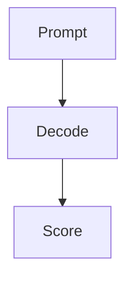

# Eval harnesses & harness engineering

## Why this matters

If your harness is wrong, every score downstream is a confident lie.

## Anchor scenarios

1. You ship a model and the eval says 92%; production says 60%.

### 10-year-old pass

A test is only fair if everyone takes the same test the same way.

### Engineer pass

A harness pins prompts, decoding, and scoring so score deltas mean capability deltas.



```text
[prompt] -> [decode] -> [score]
```

## Lab spec

Pin temperature, top-p, max_tokens; freeze prompt; record decode params.

### Drill 1

Scenario: Two graders disagree on a free-form answer.
DC1: Switch to MCQ format with locked options.
DC2: Add a tie-break grader.

### Drill 2

Scenario: Score moves 4 points after a sampler change.
DC1: Pin temperature and top-p; rerun.
DC2: Separate sampler-noise from capability delta in the report.

## Stress-test pool

- board: How would you defend the eval number to an auditor?
- researcher: What invariances does the harness preserve?
- analyst: Which decoder knob most changes the score and why?

## Flashcard seeds

- What makes an eval fair? :: Invariance to nuisance factors.
- What is a harness? :: The scaffold around the eval.

## Visuals

```viz
{
  "type": "bar-compare",
  "title": "Eval vs production score",
  "data": { "bars": [{ "label": "eval", "value": 92 }, { "label": "prod", "value": 60 }], "unit": "%" }
}
```

## Sources

- S4: Eval methodology playbook
- S5: Harness engineering notes
