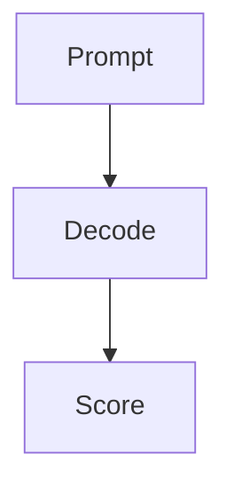

# Eval harnesses & harness engineering

## Why this matters

If your harness is wrong, every score downstream is a confident lie.

## Anchor scenarios

1. You ship a model and the eval says 92%; production says 60%.
2. The board asks why the number moved.

### 10-year-old pass

A test is only fair if everyone takes the same test the same way.

### Engineer pass

A harness pins prompts, decoding, and scoring so score deltas mean capability deltas.



```text
[prompt] -> [decode] -> [score]
```

### Operator pass

If you cannot defend the harness to an auditor, you cannot defend the number.

## Lab spec

Build a harness that pins temperature=0 and logs every prompt hash.

## Application drills

### Drill 1
Scenario: Your eval set leaked into training. What breaks and how do you detect it?
DC1: Distinguish contamination from genuine capability gain.
DC2: Propose a contamination probe that does not need the training set.

### Drill 2
Scenario: Two runs of the same model score differently.
DC1: List three nondeterminism sources.

## Stress-test pool

- board: Defend why this eval number is decision-grade.
- researcher: Argue the harness has no construct-validity leak.
- analyst: Reconcile the eval number with the production number.

## Flashcard seeds

- What makes an eval "fair"? :: Invariance to nuisance factors.
- Define construct validity. :: The eval measures the intended capability.

## Sources

- S4 — Construct validity in evals
- S5 — Harness determinism

## Visuals

```viz
{
  "type": "bar-compare",
  "title": "Eval vs production",
  "data": { "bars": [{ "label": "eval", "value": 92 }, { "label": "prod", "value": 60 }], "unit": "%" }
}
```
